## Настройка рабочей среды с помощью pass и chezmoi

**Студент:** Туйишиме Тьерри  
**Группа:** НКАбд-05-25  
**Факультет физико-математических и естественных наук**  
**РУДН**

---

## Цель работы

Настройка рабочей среды с помощью менеджера паролей pass и системы управления конфигурациями chezmoi.

---

## Задачи

1. Установка и настройка Pass
2. Настройка интерфейса с браузером
3. Управление файлами конфигурации
4. Использование chezmoi на нескольких машинах

---

## Установка Pass

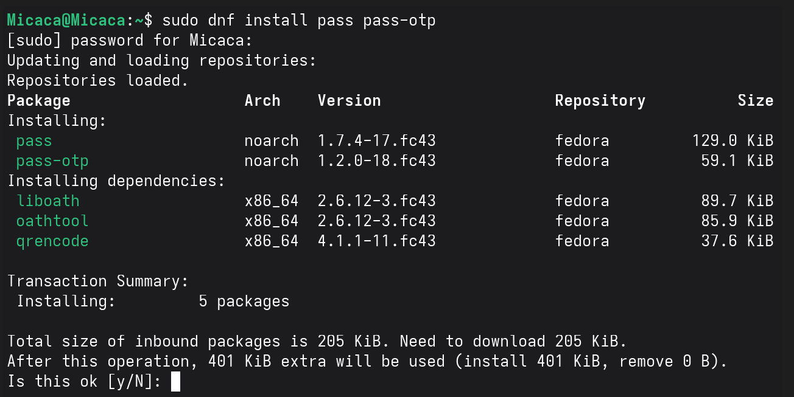

Установка pass и pass-otp

---

## Установка gopass

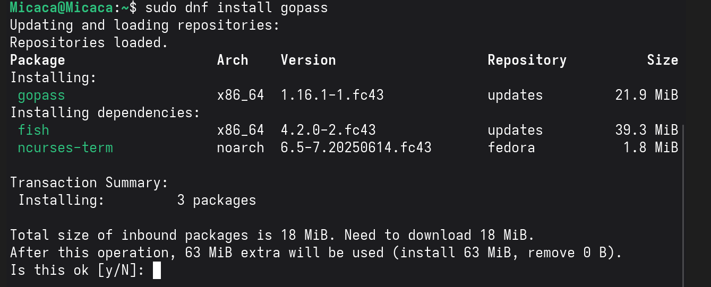

Установка дополнительного менеджера паролей

---

## Создание GPG ключа

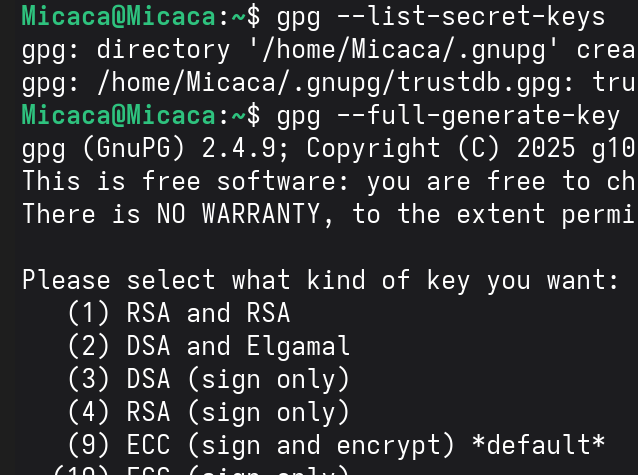

Генерация ключа для шифрования паролей

---

## Созданные ключи

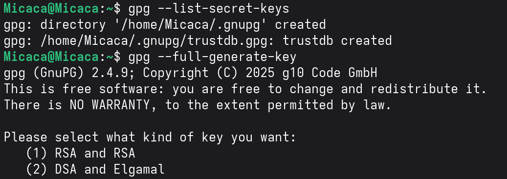

Просмотр созданных GPG ключей

---

## Инициализация хранилища

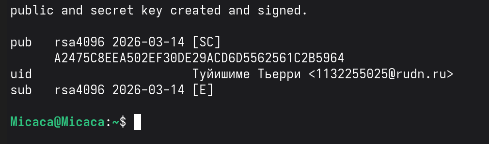

Инициализация password-store с GPG ключом

---

## Статус синхронизации

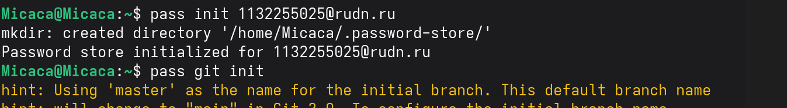

Проверка Git-статуса хранилища

---

## Настройка browserpass

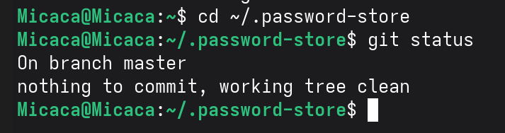

Установка плагина для Firefox

---

## Включение репозитория Copr

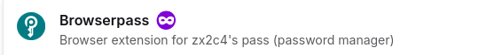

Добавление репозитория для browserpass-native

---

## Установка browserpass-native

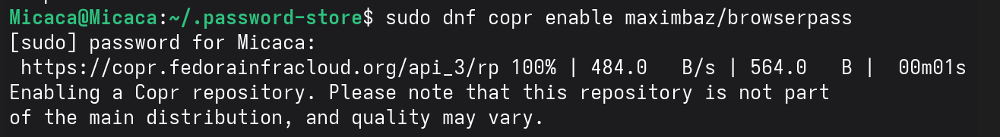

Установка native messaging host

---

## Добавление пароля

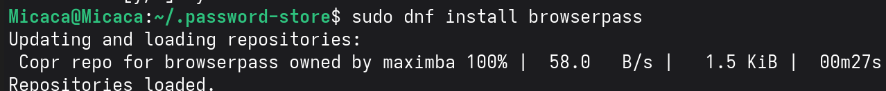

Создание нового пароля в хранилище

---

## Подтверждение пароля

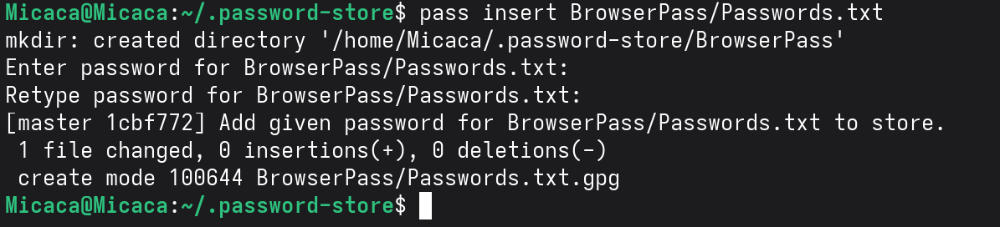

Проверка созданного пароля

---

## Замена пароля

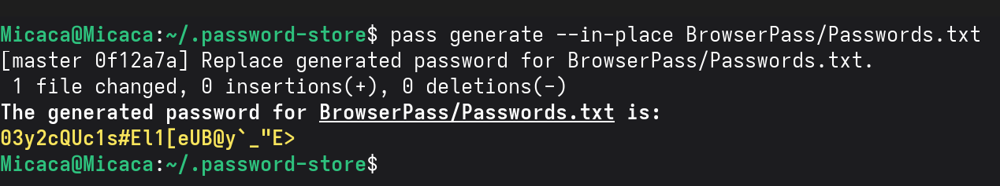

Генерация нового пароля

---

## Установка дополнительного ПО

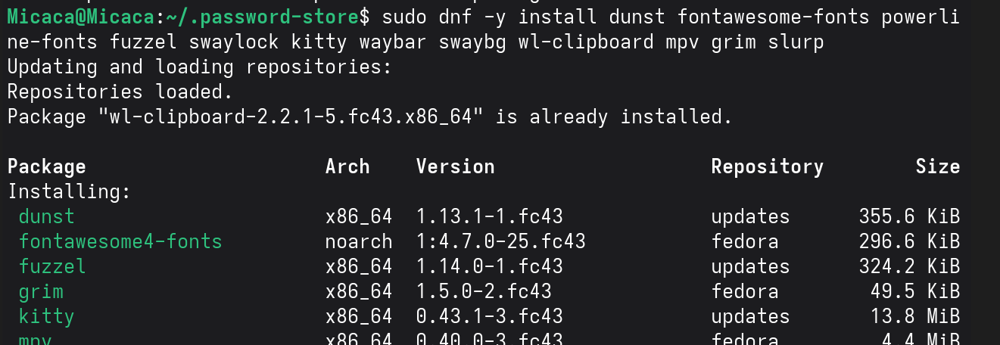

Установка make, git, ShellCheck

---

## Установка шрифтов Iosevka

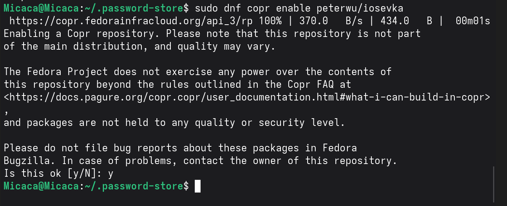

Добавление репозитория peterwu/iosevka

---

## Поиск шрифтов

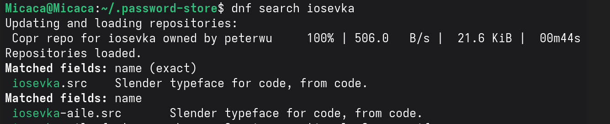

Поиск пакетов iosevka

---

## Установка шрифтов

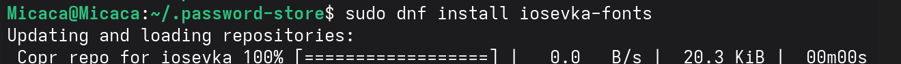

Установка iosevka-fonts

---

## Установка chezmoi

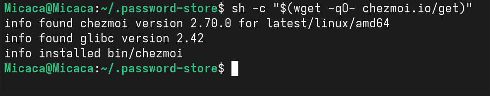

Установка бинарного файла chezmoi

---

## Создание репозитория dotfiles

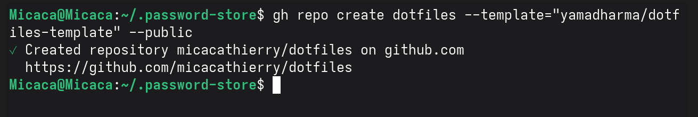

Создание репозитория на GitHub

---

## Инициализация chezmoi

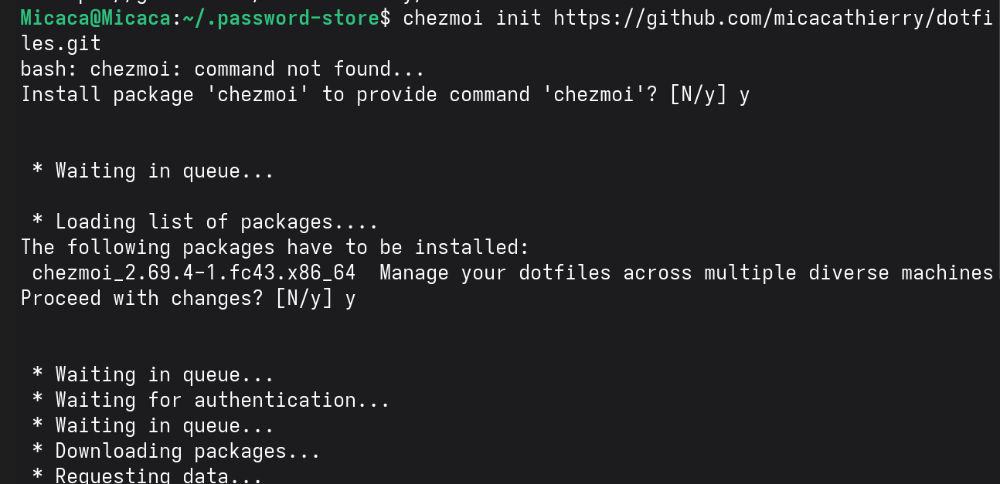

Инициализация с репозиторием dotfiles

---

## Проверка изменений

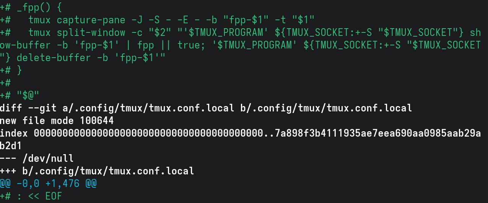

Просмотр различий с помощью chezmoi diff

---

## Применение изменений

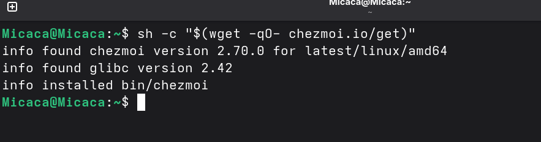

Применение конфигурации chezmoi apply

---

## Установка на другой машине

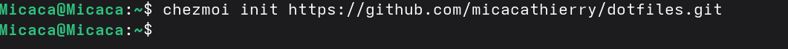

Установка chezmoi на вторую машину

---

## Инициализация на другой машине

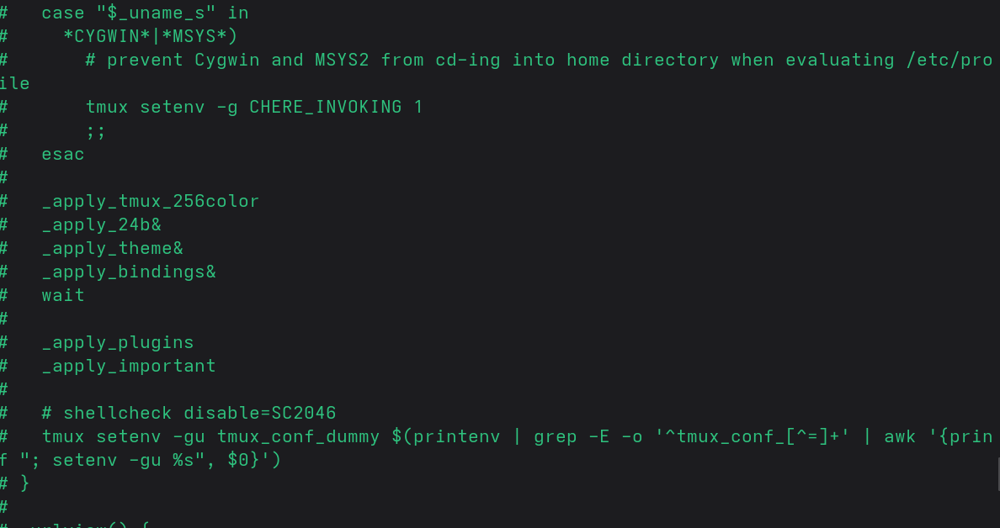

Инициализация с тем же репозиторием

---

## Проверка на второй машине

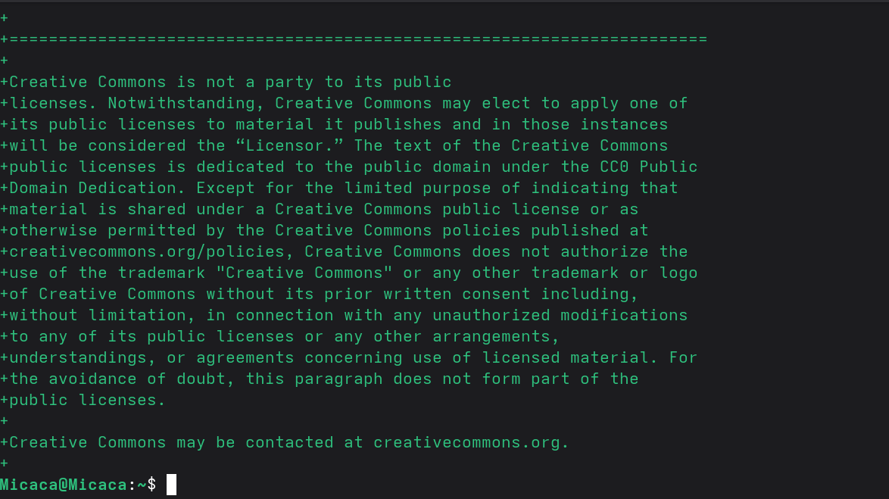

Просмотр изменений на второй машине

---

## Применение на второй машине

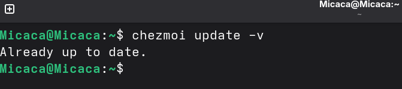

Применение изменений на второй машине

---

## Обновление chezmoi

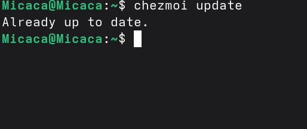

Обновление до последней версии

---

## Ежедневные операции

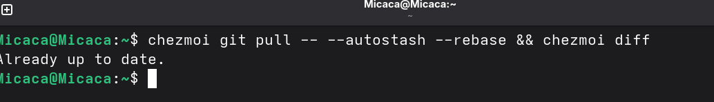

Обновление на основной машине

---

## Извлечение изменений

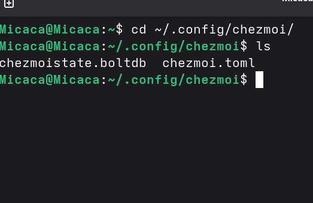

Выполнение git pull с chezmoi

---

## Применение изменений после обновления

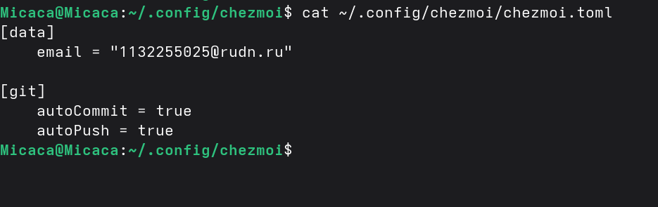

Применение актуальных изменений

---

## Конфигурация chezmoi

Настройки автоматического коммита и пуша

---

## Выводы

- Настроен менеджер паролей pass с GPG шифрованием
- Интегрирован pass с браузером через browserpass
- Установлена и настроена система управления конфигурациями chezmoi
- Освоена синхронизация конфигураций между несколькими машинами
- Настроено автоматическое сохранение изменений в репозиторий

---

## Спасибо за внимание!

**Вопросы?**
