Студент: ТУЙИШИМЕ Тьерри

Группа: НКАбд-05-25

# Содержание {#содержание .TOC-Heading}

[1 Цель работы [1](#цель-работы)](#цель-работы)

[2 Задание [1](#задание)](#задание)

[3 Выполнение лабораторной работы
[1](#выполнение-лабораторной-работы)](#выполнение-лабораторной-работы)

[3.1 Определение полного имени домашнего каталога.
[1](#определение-полного-имени-домашнего-каталога.)](#определение-полного-имени-домашнего-каталога.)

[3.2 Выполнение некоторых действиях.
[2](#выполнение-некоторых-действиях.)](#выполнение-некоторых-действиях.)

[3.3 Определение опции команды с помощью man.
[5](#определение-опции-команды-с-помощью-man.)](#определение-опции-команды-с-помощью-man.)

[3.4 Использование команду history.
[7](#использование-команду-history.)](#использование-команду-history.)

[4 Выводы [8](#выводы)](#выводы)

[5 Ответы на контрольные вопросы
[9](#ответы-на-контрольные-вопросы)](#ответы-на-контрольные-вопросы)

[Список литературы [11](#список-литературы)](#список-литературы)

# 1 Цель работы

Приобретение практических навыков взаимодействия пользователя с системой
по средством командной строки.

# 2 Задание

1.  Определить полное имя домашнего каталога.
2.  Выполнить некоторые действия.
3.  Определить опции команды с помощью man.
4.  Использовать команду history.

# 3 Выполнение лабораторной работы

## 3.1 Определение полного имени домашнего каталога.

Для определения полного имени каталога я использую команду pwd.
Выводится, что я в домашнем каталоге (home/mwakutaipa):

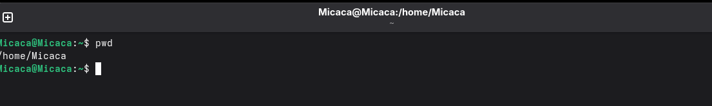
Рис. 1: Команда pwd

## 3.2 Выполнение некоторых действиях.

Далее с помошью cd я перехожу в каталог /tmp и вывожу на экран
содержимое каталога с помощью ls:

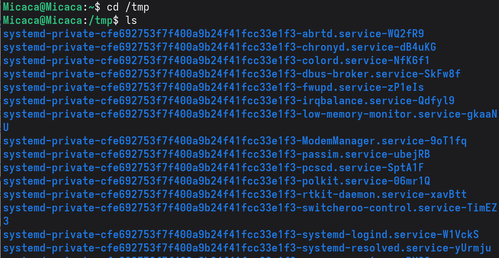
Рис. 2: Каталог /tmp

Вывожу на экран содержимое каталога с помощью ls -l, чтобы вывести на
экран подробную информацию о файлах и каталогах (тип файла, право
доступа, число ссылок, владелец, размер, дата последней ревизии, имя
файла или каталога.):

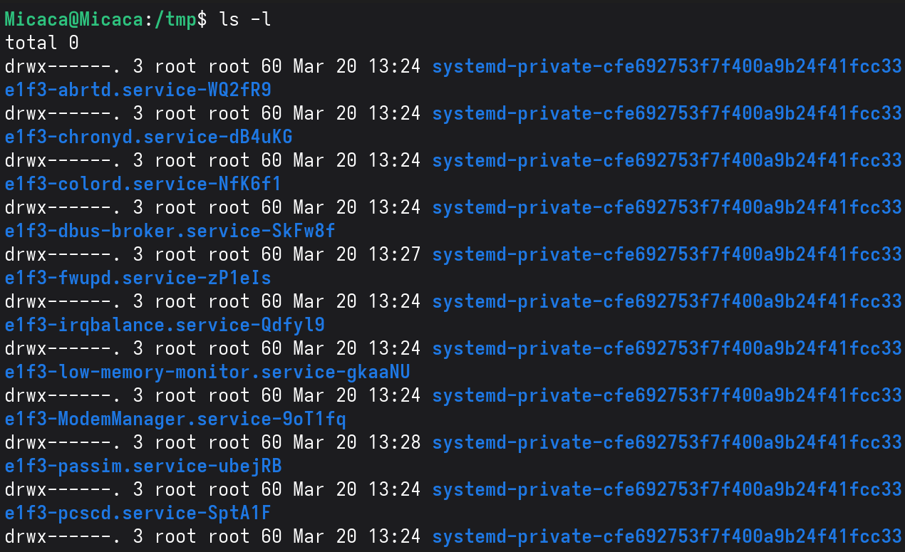
Рис. 3: Содержаемое /tmp

Вывожу на экран содержимое каталога с ls -F, для получение информацию о
типах файлов (каталог, исполняемый файл, ссылка):

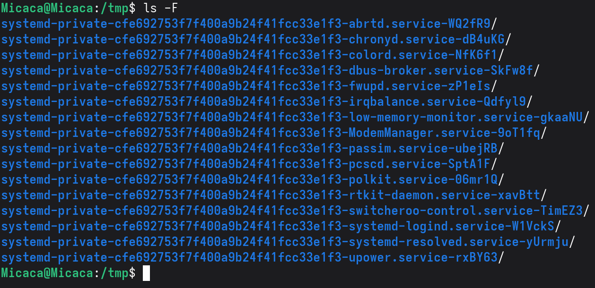
Рис. 4: Тип файлы

Вывожу на экран содержимое каталога с ls -a, чтобы отобразить скрытых от
просмотра файлов:

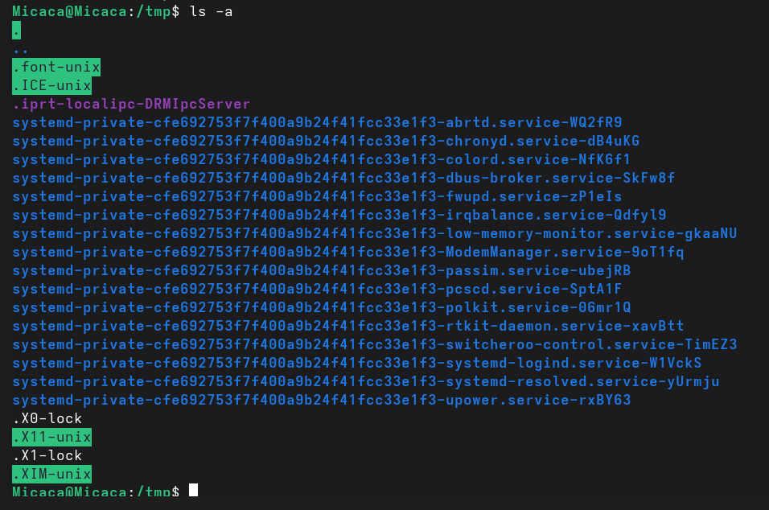
Рис. 5: Скрытые файлы

Я перехожу в каталог /var/spool/ и вывожу на экран содержимое каталога с
помощью ls. Вижу, что в нем есть подкаталог cron:

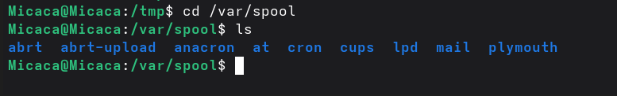
Рис. 6: Нахождение подкаталога cron

Перехожу в домашний каталог и вывожу содержиемое с помощью ls -l. Видно,
что mwakutaipa является владельцем файлов и подкаталогов:

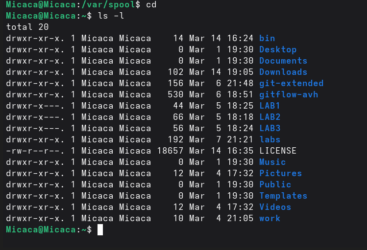
Рис. 7: владельца файлов

В домашнем каталоге создаю новый каталог с именем newdir и в этом же
каталоге создайте новый каталог с именем morefun одной командой. Далее
использую ls, чтобы проверять:

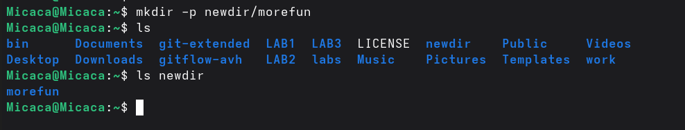
Рис. 8: Создание newdir и morefun

Создаю одной командой еще три новых каталога с именами letters, memos,
misk и проверяю создание:

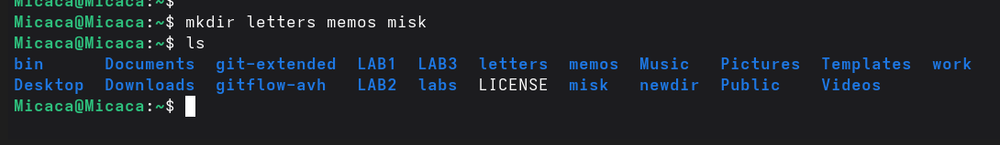
Рис. 9: Создание letters, memos, misk

Удаляю эти каталоги одной командой rmdir и проверяю:

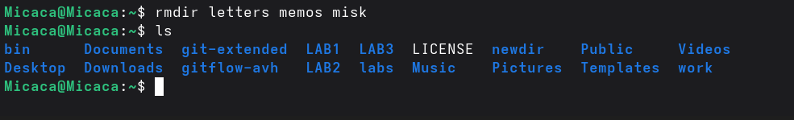
alt="Удаление letters, memos, misk" />
Рис. 10: Удаление letters, memos, misk

Удаляю каталог \~/newdir/morefun из домашнего каталога и проверяю, был
ли каталог удалён:

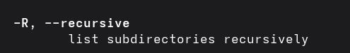
Рис. 11: Удаление ~/newdir/morefun

## 3.3 Определение опции команды с помощью man.

С помощью команды man определяю, какую опцию команды ls нужно
использовать для просмотра содержимое не только указанного каталога, но
и подкаталогов, входящих в него. Это является опцией -R:

Рис. 12: опция ls для просмотра
содержимое

Определяю набор опций команды ls, позволяющий отсортировать по времени
последнего изменения выводимый список содержимого каталога с развёрнутым
описанием файлов. Это является опцией -с:

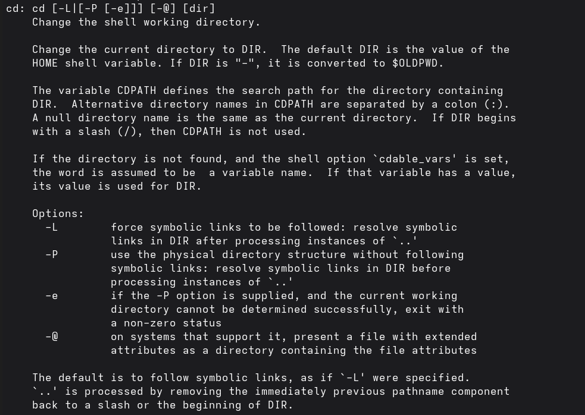
Рис. 13: Определение опций команды ls для
отсортирование

С помощью man cd, узнаю описание cd и ее опции. -L переходить по
символическим ссылкам после того, как обработаны все переходы. -P
позволяет следовать по символическим ссылкам перед тем, как обработаны
все переходы. -e позволяет выйти с ошибкой, если директория, в которую
нужно перейти, не найдена.

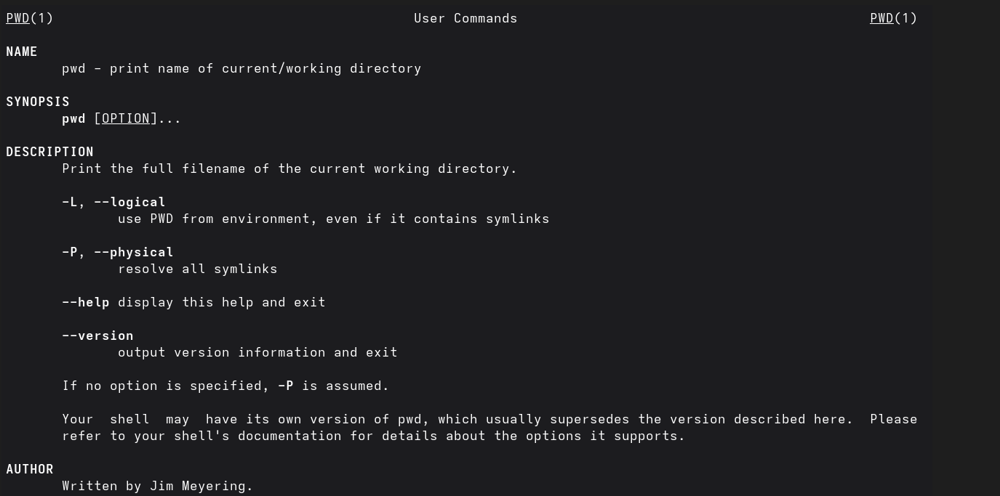
Рис. 14: Описание опции cd

С помощью man pwd узнаю описание команду и ее опции. -L - брать
директорию из переменной окружения. -P - отрасывать все символические
ссылки.

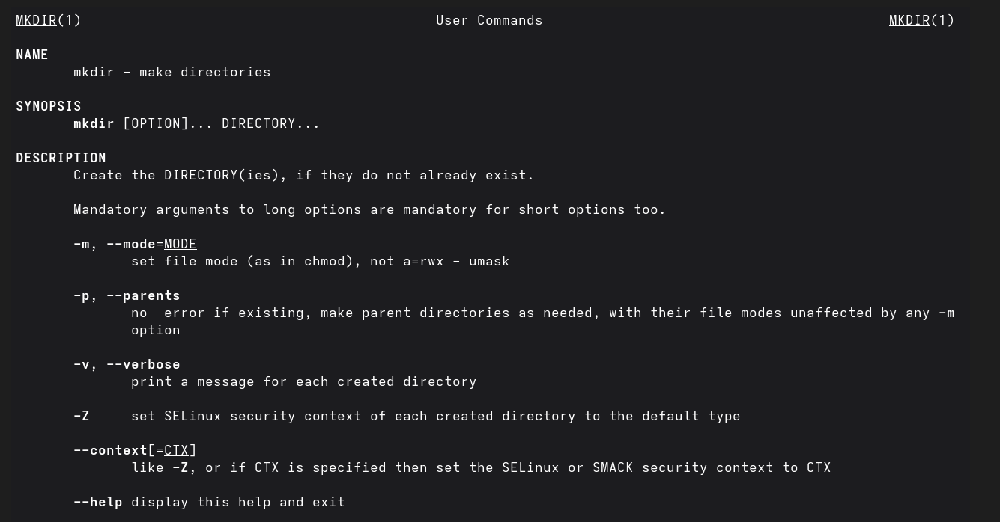
Рис. 15: Описание опции pwd

Описание опции mkdir: -m -- устанавливается права доступа. -p --
рекурсивнно создать каталог и подкаталоги. -v -- сообшается о созданных
директориях. -z -- устанавливается SELinux для создаваемой директории по
умолчанию.

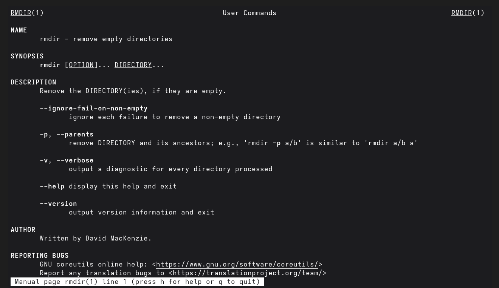
Рис. 16: Описание опции mkdir

Описание опции rmdir: --ignore-fail-on-non-empty -- отмняет вывод ошибки
если каталог не пустой. -p -- удалить рекурсивнно каталог и подкаталоги.
-v -- выводить сообшение о каждом удаленный директории.

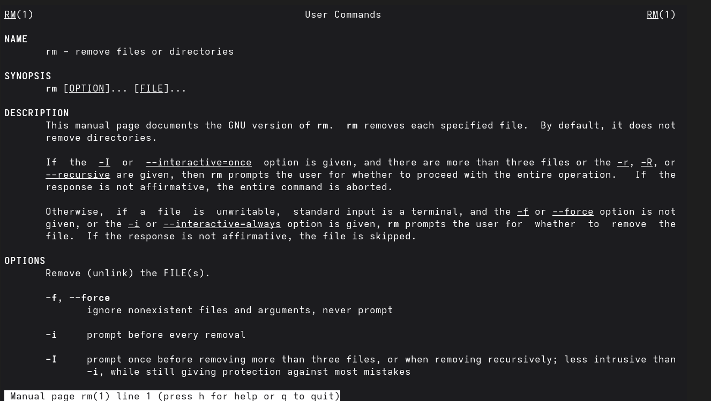
Рис. 17: Описание опции rmdir

Описание опции rm: -f -- игнорировать несуществующие файлы и аргументы,
не выводит запрос на подтверждение удаления. -i -- выводит запрос на
подтверждение удаления -I -- выводит один раз запрос на подтверждение
удаления если удаление рекурсивнно или больше 3 раза

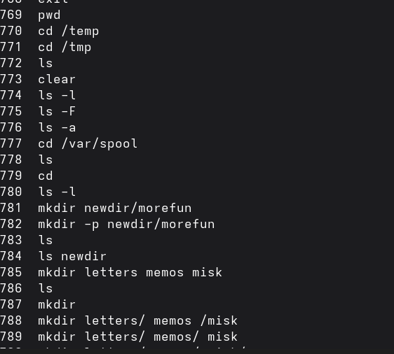
Рис. 18: Описание опции rm

## 3.4 Использование команду history.

Используя информацию, полученную при помощи команды history:

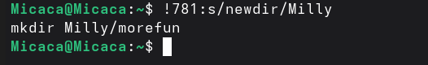
Рис. 19: команда history

Выполняю модификацию и исполнение нескольких команд из буфера команд:

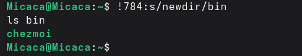
Рис. 20: модификацию и исполнение команды
mkdir

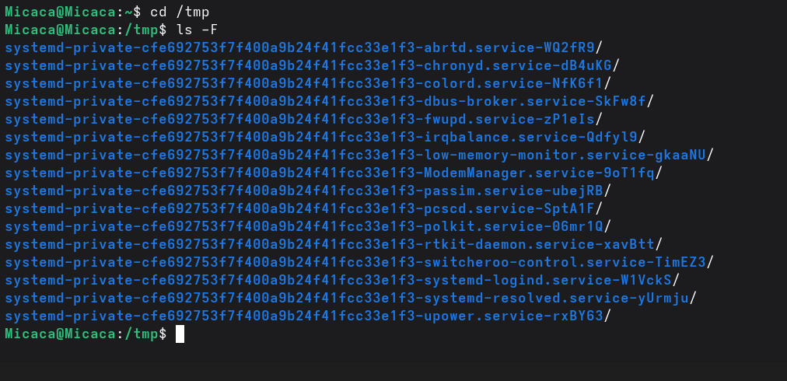
Рис. 21: модификацию и исполнение команды
ls

# 4 Выводы

При выполнении данной работы я приобретела практические навыки
взаимодействия пользователя с системой по средством командной строки.

# 5 Ответы на контрольные вопросы

1.  Текстовая система, которая передает комманды компьютеру и возврашает
    результаты пользователю.

2.  pwd. Пример: если я нохожусь в своем домашнем каталоге и запускаю
    pwd в командной строке , то я увижу результат /home/mwakutaipa.

3.  ls с опцией -F. Например:

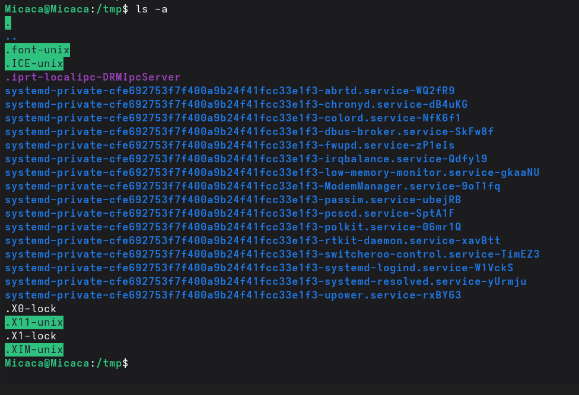
Рис. 22: Пример по использованию ls с опцией
-F

4.  ls с опцией -а. Например:

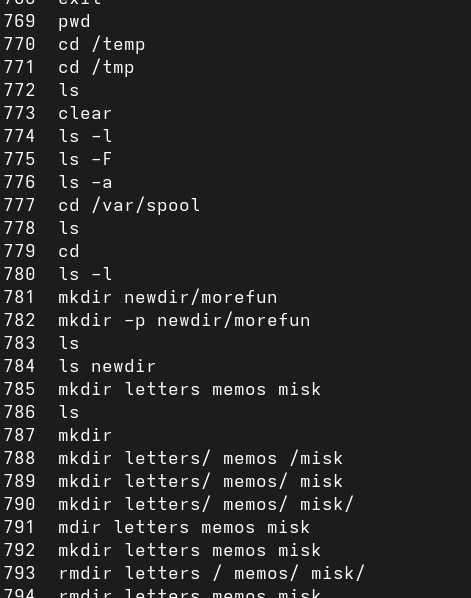
Рис. 23: Пример по использованию ls с опцией
-а

5.  rmdir по умолчанию удаляет пустые каталоги, не удаляет файлы. rm
    удаляет файлы, без дополнительных опций (-d, -r) не будет удалять
    каталоги. Удалить в одной строчке одной командой можно файл и
    каталог. Если файл находится в каталоге, используем рекурсивное
    удаление, если файл и каталог не связаны подобным образом, то
    добавим опцию -d, введя имена через пробел после утилиты.

6.  Вывести информацию о последних выполненных пользователем команд
    можно с помощью history. Пример:

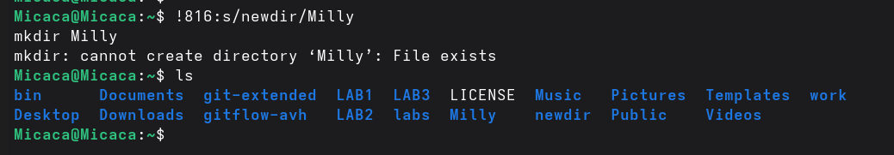
Рис. 24: Название рисунка

7.  Используем синтаксиси !номер команды в выводе history:s/что
    заменяем/на что заменяем Примеры:

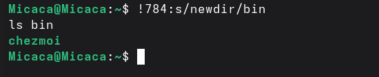
Рис. 25: Пример 1 по использованию
history

Рис. 26: Пример 2 по использованию
history

8.  Если я введу "cd ; ls" в домашнем каталоге, то окажусь в домашнем
    каталоге и получу вывод файлов внутри него.

9.  Символ экранирования - (обратный слеш) добавление перед спецсимволом
    обратный слеш, чтобы использовать специальный символ как обычный.
    Также позволяет читать системе название директорий с пробелом.
    Пример: cd work/Операционные системы/

10. Опция -l позволит увидеть дополнительную информацию о файлах в
    каталоге: время создания, владельца, права доступа

11. Относительный путь к файлу начинается из той директории, где вы
    находитесь (она сама не прописывается в пути), он прописывается
    относительно данной директории. Абсолютный путь начинается с
    корневого каталога.

12. Использовать man или --help

13. Клавиша Tab.

# Список литературы

[**Ошибка! Недопустимый объект гиперссылки.**]()
