Студент: ТУЙИШИМЕ Тьерри

Группа: НКАбд-05-25

# Содержание {#содержание .TOC-Heading}

[1 Цель работы [1](#section)](#section)

[2 Задание [1](#задание)](#задание)

[3 Выполнение лабораторной работы
[1](#выполнение-лабораторной-работы)](#выполнение-лабораторной-работы)

[3.1 Команды для работы с файлами и каталогами
[1](#команды-для-работы-с-файлами-и-каталогами)](#команды-для-работы-с-файлами-и-каталогами)

[4 Выводы [7](#выводы)](#выводы)

[4.1 Ответы на контрольные вопросы
[7](#ответы-на-контрольные-вопросы)](#ответы-на-контрольные-вопросы)

# 

# 1 Цель работы

Ознакомление с файловой системой Linux, её структурой, именами и
содержанием каталогов. Приобретение практических навыков по применению
команд для работы с файлами и каталогами, по управлению процессами (и
работами), по проверке использования диска и обслуживанию файловой
системы.

# 2 Задание

1.  Команды для работы с файлами и каталогами
2.  Анализ файловой системы Linux.

# 3 Выполнение лабораторной работы

## 3.1 Команды для работы с файлами и каталогами

Создаю файл abc1 с помощью touch и копирую его с новыми именами april и
may исползуя cp:

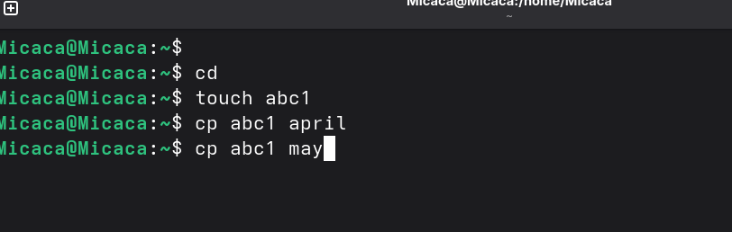
Рис. 1: Создание файлов abc1, april и
may

Создаю каталог monthly и копирую april и may в нем исползуя cp. Проверяю
с ls:

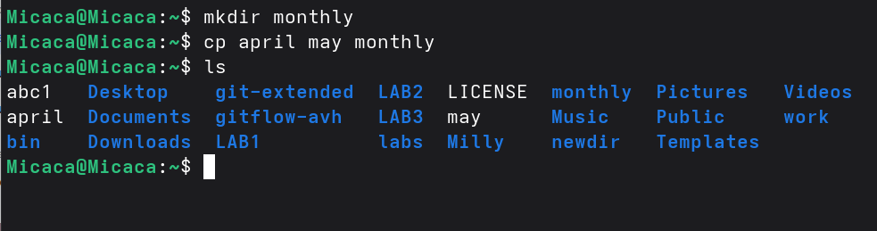
Рис. 2: Создание monthly

В каталоге monthly копирую файл may с именем june исползуя cp:

Рис. 3: копирование файла may

Копирую каталог monthly в каталог monthly.00 с помощью опции cp -r:

Рис. 4: копирование каталога monthly

Копирую каталог monthly.00 в каталог /tmp:

Рис. 5: копирование каталога monthly.00

Изменяю название файла april на july в домашнем каталоге и перемещаю
файл july в каталог monthly.00:

Рис. 6: Перемещение файла july

Переименовываю каталог monthly.00 в monthly.01. Перемещаю каталог
monthly.01 в каталог reports:

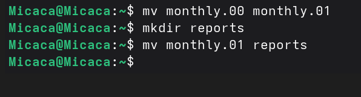
Рис. 7: Перемещение и переименование каталога
monthly.00

Переименовываю каталог reports/monthly.01 в reports/monthly:

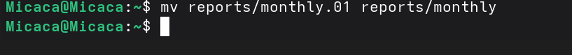
Рис. 8: переименование каталога
reports/monthly.01

Копирую файл /usr/include/sys/io.h в домашний каталог и назову его
equipment:

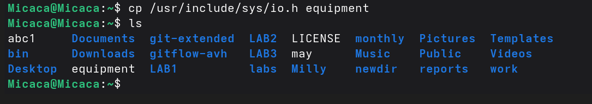
Рис. 9: Создание equipment

В домашнем каталоге создаю директорию \~/ski.plases с помощью mkdir:

Рис. 10: Проверка создания ski.plases

Перемещаю файл equipment в каталог \~/ski.plases:

Рис. 11: Перемещение файла equipment

Переименую файл \~/ski.plases/equipment в \~/ski.plases/equiplist и
копирую abc1 в каталог \~/ski.plases, назову его equiplist2:

Рис. 12: Переименование файла /equipment

Создаю каталог с именем equipment в каталоге \~/ski.plases и перемещаю
файлы \~/ski.plases/equiplist и equiplist2 в каталог
\~/ski.plases/equipment:

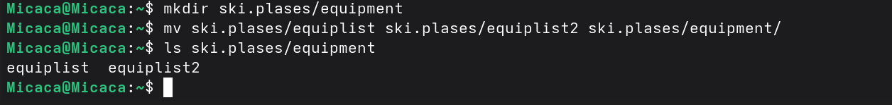
Рис. 13: Создание каталога equipment, перемещение
файлов

Создаю и перемещаю каталог \~/newdir в каталог \~/ski.plases и назову
его plans:

Рис. 14: Создание и перемещение каталога
~/newdir

Создаю каталог australia. Удаляю права на исполнение для группы (g-x) и
владелца(u-x):

Рис. 15: Создание australia

Рис. 16: Удаление права

Изменяю права доступа к каталогу play и проверяю:

Рис. 17: Измениеие прав

Рис. 18: Проверка изменений

Изменяю права доступа к файлу feathers и проверяю:

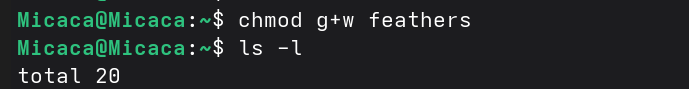
Рис. 19: Измениеие прав к файлу feathers

Смотрю содержимое файла /etc/passwd:

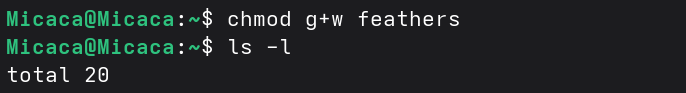
Рис. 20: команда cat

Копирую файл \~/feathers в файл \~/file.old, перемещаю файл \~/file.old
в каталог \~/play и копирую каталог \~/play в каталог \~/fun:

Рис. 21: Перемещение и копирование файлов и
каталогов

Перемещаю каталог \~/fun в каталог \~/play и назову его games:

Рис. 22: Перемещение каталога fun

Лишаю пользователя файла \~/feathers права на чтение:

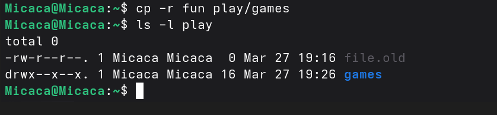
Рис. 23: Лишение права на читение

Когда я попытаюсь просмотреть файл \~/feathers командой cat, система
запрешает мне:

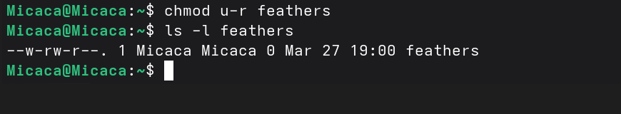
Рис. 24: Посмотра файла feathers

Лишаю владельца каталога \~/play права на выполнение. Когда я попробую
перейти в этот же каталог, система запрешает мне:

ch{width="4.558186789151356in"
height="1.0763888888888888in"}

Рис. 25: Лишение права на выполнение

Даю владельцу каталога \~/play право на выполнение:

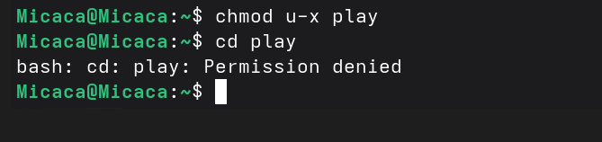
Рис. 26: Название рисунка

С помощью man прочитаю по следующим командам: mount --- утилита
командной строки в UNIX-подобных операционных системах. Применяется для
монтирования файловых систем.

Рис. 27: mount

fsck (проверка файловой системы) - это утилита командной строки, которая
позволяет выполнять проверки согласованности и интерактивное исправление
в одной или нескольких файловых системах Linux. Он использует программы,
специфичные для типа файловой системы, которую он проверяет.

Рис. 28: fsck

mkfs используется для создания файловой системы Linux на некотором
устройстве, обычно в разделе жёсткого диска. В качестве аргумента
filesys для файловой системы может выступать или название устройства

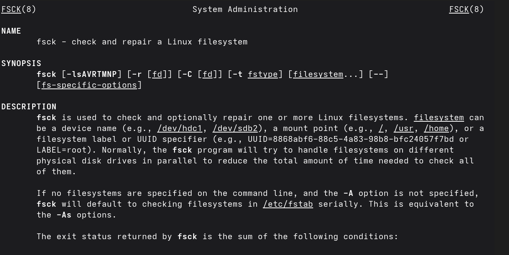
Рис. 29: mkfs

Команда Kill посылает указанный сигнал указанному процессу. Если не
указано ни одного сигнала, посылается сигнал SIGTERM. Сигнал SIGTERM
завершает лишь те процессы, которые не обрабатывают его приход. Для
других процессов может быть необходимым послать сигнал SIGKILL,
поскольку этот сигнал перехватить невозможно.

Рис. 30: Kill

# 4 Выводы

При выполнении данной лабораторной работы я ознакомилась с файловой
системой Linux, её структурой, именами и содержанием каталогов.
Приобрела практические навыки по применению команд для работы с файлами
и каталогами, по управлению процессами (и работами), по проверке
использования диска и обслуживанию файловой системы.

## 4.1 Ответы на контрольные вопросы

1.  Ext2, Ext3, Ext4 или Extended Filesystem - это стандартная файловая
    система для Linux. Она была разработана еще для Minix. Она самая
    стабильная из всех существующих, кодовая база изменяется очень редко
    и эта файловая система содержит больше всего функций. Версия ext2
    была разработана уже именно для Linux и получила много улучшений. В
    2001 году вышла ext3, которая добавила еще больше стабильности
    благодаря использованию журналирования. В 2006 была выпущена версия
    ext4, которая используется во всех дистрибутивах Linux до
    сегодняшнего дня. В ней было внесено много улучшений, в том числе
    увеличен максимальный размер раздела до одного экзабайта.

Btrfs или B-Tree File System - это совершенно новая файловая система,
которая сосредоточена на отказоустойчивости, легкости администрирования
и восстановления данных. Файловая система объединяет в себе очень много
новых интересных возможностей, таких как размещение на нескольких
разделах, поддержка подтомов, изменение размера не лету, создание
мгновенных снимков, а также высокая производительность. Но многими
пользователями файловая система Btrfs считается нестабильной. Тем не
менее, она уже используется как файловая система по умолчанию в OpenSUSE
и SUSE Linux.

2.  / --- root каталог. Содержит в себе всю иерархию системы;

/bin --- здесь находятся двоичные исполняемые файлы. Основные общие
команды, хранящиеся отдельно от других программ в системе (прим.: pwd,
ls, cat, ps);

/boot --- тут расположены файлы, используемые для загрузки системы
(образ initrd, ядро vmlinuz);

/dev --- в данной директории располагаются файлы устройств (драйверов).
С помощью этих файлов можно взаимодействовать с устройствами. К примеру,
если это жесткий диск, можно подключить его к файловой системе. В файл
принтера же можно написать напрямую и отправить задание на печать;

/etc --- в этой директории находятся файлы конфигураций программ. Эти
файлы позволяют настраивать системы, сервисы, скрипты системных демонов;

/home --- каталог, аналогичный каталогу Users в Windows. Содержит
домашние каталоги учетных записей пользователей (кроме root). При
создании нового пользователя здесь создается одноименный каталог с
аналогичным именем и хранит личные файлы этого пользователя;

/lib --- содержит системные библиотеки, с которыми работают программы и
модули ядра;

/lost+found --- содержит файлы, восстановленные после сбоя работы
системы. Система проведет проверку после сбоя и найденные файлы можно
будет посмотреть в данном каталоге;

/media --- точка монтирования внешних носителей. Например, когда вы
вставляете диск в дисковод, он будет автоматически смонтирован в
директорию /media/cdrom;

/mnt --- точка временного монтирования. Файловые системы подключаемых
устройств обычно монтируются в этот каталог для временного
использования;

/opt --- тут расположены дополнительные (необязательные) приложения.
Такие программы обычно не подчиняются принятой иерархии и хранят свои
файлы в одном подкаталоге (бинарные, библиотеки, конфигурации);

/proc --- содержит файлы, хранящие информацию о запущенных процессах и о
состоянии ядра ОС;

/root --- директория, которая содержит файлы и личные настройки
суперпользователя;

/run --- содержит файлы состояния приложений. Например, PID-файлы или
UNIX-сокеты;

/sbin --- аналогично /bin содержит бинарные файлы. Утилиты нужны для
настройки и администрирования системы суперпользователем;

/srv --- содержит файлы сервисов, предоставляемых сервером (прим. FTP
или Apache HTTP);

/sys --- содержит данные непосредственно о системе. Тут можно узнать
информацию о ядре, драйверах и устройствах;

/tmp --- содержит временные файлы. Данные файлы доступны всем
пользователям на чтение и запись. Стоит отметить, что данный каталог
очищается при перезагрузке;

/usr --- содержит пользовательские приложения и утилиты второго уровня,
используемые пользователями, а

не системой. Содержимое доступно только для чтения (кроме root). Каталог
имеет вторичную иерархию и похож на корневой;

/var --- содержит переменные файлы. Имеет подкаталоги, отвечающие за
отдельные переменные. Например, логи будут храниться в /var/log, кэш в
/var/cache, очереди заданий в /var/spool/ и так далее.

3.  Монтирование тома.

4.  Один блок адресуется несколькими mode (принадлежит нескольким
    файлам). Блок помечен как свободный, но в то же время занят (на него
    ссылается onode). Блок помечен как занятый, но в то же время
    свободен (ни один inode на него не ссылается). Неправильное число
    ссылок в inode (недостаток или избыток ссылающихся записей в
    каталогах). Несовпадение между размером файла и суммарным размером
    адресуемых inode блоков. Недопустимые адресуемые блоки (например,
    расположенные за пределами файловой системы). "Потерянные" файлы
    (правильные inode, на которые не ссылаются записи каталогов).
    Недопустимые или неразмещенные номера inode в записях каталогов.

5.  mkfs - позволяет создать файловую систему Linux.

6.  Cat - выводит содержимое файла на стандартное устройство вывода.
    Выполнение команды head выведет первые 10 строк текстового файла.
    Выполнение команды tail выведет последние 10 строк текстового файла.
    Команда tac - это тоже самое, что и cat, только отображает строки в
    обратном порядке. Для того, чтобы просмотреть огромный текстовый
    файл применяются команды для постраничного просмотра. Такие как more
    и less.

7.  Cp -- копирует или перемещает директорию, файлы.

8.  Mv - переименовать или переместить файл или директорию

9.  Права доступа к файлу или каталогу можно изменить, воспользовавшись
    командой chmod. Сделать это может владелец файла (или каталога) или
    пользователь с правами администратора.
