---
author:
- Туйишиме Тьерри
authors:
- address: ул. Миклухо-Маклая, д. 6
  email: 1132255025@rudn.ru
  name: Туйишиме Тьерри
bibliography:
- bib/cite.bib
crossref:
  lof-title: Список иллюстраций
  lol-title: Листинги
  lot-title: Список таблиц
csl: \_resources/csl/gost-r-7-0-5-2008-numeric.csl
date: 2026-03-28
institute: Российский университет дружбы народов
institutes:
- Российский университет дружбы народов
lang: ru-RU
title: Лабораторная работа №7
toc-title: Содержание
---

-   [[1]{.toc-section-number} Введение](#введение){#toc-введение}
-   [[2]{.toc-section-number} Задание](#задание){#toc-задание}
-   [[3]{.toc-section-number} Выполнение лабораторной
    работы](#выполнение-лабораторной-работы){#toc-выполнение-лабораторной-работы}
    -   [[3.1]{.toc-section-number} Команды для работы с файлами и
        каталогами](#команды-для-работы-с-файлами-и-каталогами){#toc-команды-для-работы-с-файлами-и-каталогами}
-   [[4]{.toc-section-number} Выводы](#выводы){#toc-выводы}
-   [[5]{.toc-section-number} Список
    литературы](#список-литературы){#toc-список-литературы}

# Введение {#введение number="1"}

Целью данной работы является ознакомление с файловой системой Linux, её
структурой, именами и содержанием каталогов. Приобретение практических
навыков по применению команд для работы с файлами и каталогами, по
управлению процессами, по проверке использования диска и обслуживанию
файловой системы.

# Задание {#задание number="2"}

1.  Выполнить команды для работы с файлами и каталогами
2.  Изучить файловую систему Linux

# Выполнение лабораторной работы {#выполнение-лабораторной-работы number="3"}

## Команды для работы с файлами и каталогами {#команды-для-работы-с-файлами-и-каталогами number="3.1"}

Создаю файл abc1 с помощью touch и копирую его с новыми именами april и
may используя cp:

*Рис. 1: Создание файлов abc1, april и may*

Создаю каталог monthly и копирую april и may в него, используя cp:

*Рис. 2: Создание monthly*

В каталоге monthly копирую файл may с именем june используя cp:

*Рис. 3: Копирование файла may*

Копирую каталог monthly в каталог monthly.00 с помощью опции cp -r:

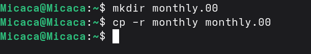

*Рис. 4: Копирование каталога monthly*

Копирую каталог monthly.00 в каталог /tmp:

*Рис. 5: Копирование каталога monthly.00*

Изменяю название файла april на july в домашнем каталоге и перемещаю
файл july в каталог monthly.00:

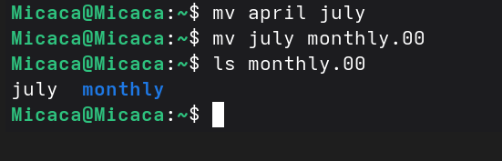

*Рис. 6: Перемещение файла july*

Переименовываю каталог monthly.00 в monthly.01. Перемещаю каталог
monthly.01 в каталог reports:

*Рис. 7: Перемещение и переименование каталога monthly.00*

Переименовываю каталог reports/monthly.01 в reports/monthly:

*Рис. 8: Переименование каталога reports/monthly.01*

Копирую файл /usr/include/sys/io.h в домашний каталог и называю его
equipment:

*Рис. 9: Создание equipment*

В домашнем каталоге создаю директорию \~/ski.plases с помощью mkdir:

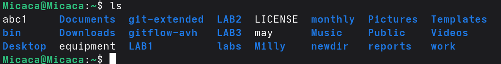

*Рис. 10: Проверка создания ski.plases*

Перемещаю файл equipment в каталог \~/ski.plases:

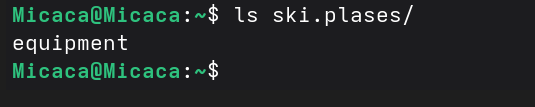

*Рис. 11: Перемещение файла equipment*

Переименовываю файл \~/ski.plases/equipment в \~/ski.plases/equiplist и
копирую abc1 в каталог \~/ski.plases, называю его equiplist2:

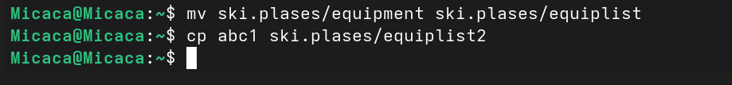

*Рис. 12: Переименование файла equipment*

Создаю каталог с именем equipment в каталоге \~/ski.plases и перемещаю
файлы \~/ski.plases/equiplist и equiplist2 в каталог
\~/ski.plases/equipment:

*Рис. 13: Создание каталога equipment, перемещение файлов*

Создаю и перемещаю каталог \~/newdir в каталог \~/ski.plases и называю
его plans:

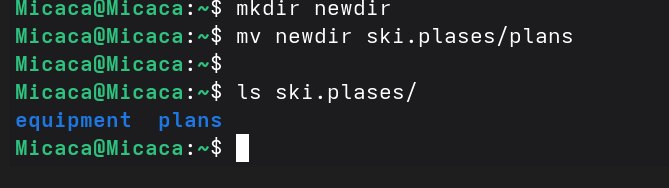

*Рис. 14: Создание и перемещение каталога \~/newdir*

Создаю каталог australia. Удаляю права на исполнение для группы (g-x) и
владельца (u-x):

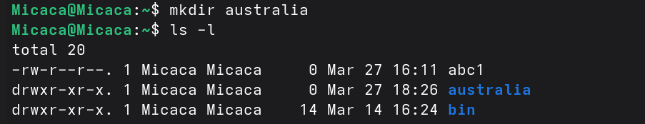 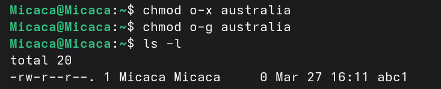

*Рис. 15-16: Создание australia и удаление прав*

Изменяю права доступа к каталогу play и проверяю:

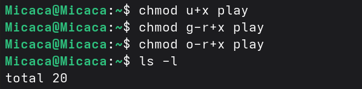 

*Рис. 17-18: Изменение прав к каталогу play*

Изменяю права доступа к файлу feathers и проверяю:

*Рис. 19: Изменение прав к файлу feathers*

Смотрю содержимое файла /etc/passwd:

*Рис. 20: Команда cat*

Копирую файл \~/feathers в файл \~/file.old, перемещаю файл \~/file.old
в каталог \~/play и копирую каталог \~/play в каталог \~/fun:

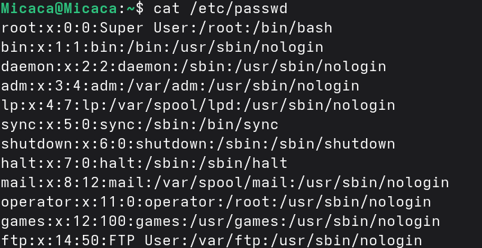

*Рис. 21: Перемещение и копирование файлов и каталогов*

Перемещаю каталог \~/fun в каталог \~/play и называю его games:

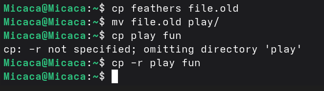

*Рис. 22: Перемещение каталога fun*

Лишаю пользователя файла \~/feathers права на чтение:

*Рис. 23: Лишение права на чтение*

Когда я попытаюсь просмотреть файл \~/feathers командой cat, система
запрещает мне:

*Рис. 24: Просмотр файла feathers*

Лишаю владельца каталога \~/play права на выполнение. Когда я попробую
перейти в этот же каталог, система запрещает мне:

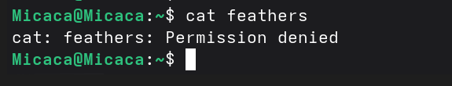

*Рис. 25: Лишение права на выполнение*

Даю владельцу каталога \~/play право на выполнение:

*Рис. 26: Восстановление права на выполнение*

С помощью man читаю информацию по следующим командам:

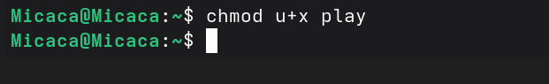 *Рис. 27: man mount*

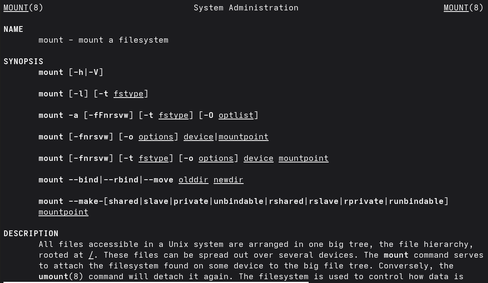 *Рис. 28: man fsck*

 *Рис. 29: man mkfs*

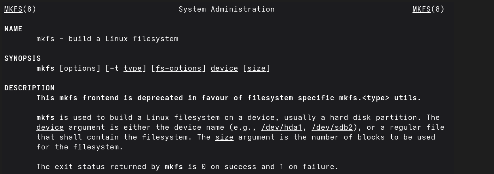 *Рис. 30: man kill*

# Выводы {#выводы number="4"}

При выполнении данной лабораторной работы я ознакомился с файловой
системой Linux, её структурой, именами и содержанием каталогов. Приобрел
практические навыки по применению команд для работы с файлами и
каталогами, по управлению процессами, по проверке использования диска и
обслуживанию файловой системы.

# Список литературы {#список-литературы number="5"}

[Архитектура ЭВМ](https://esystem.rudn.ru/mod/page/view.php?id=1098796)
