Студент: ТУЙИШИМЕ Тьерри

Группа: НКАбд-05-25

#  {#section .TOC-Heading}

# Содержание {#содержание .TOC-Heading}

[1 Цель работы [1](#цель-работы)](#цель-работы)

[2 Задание [1](#задание)](#задание)

[3 Выполнение лабораторной работы
[2](#выполнение-лабораторной-работы)](#выполнение-лабораторной-работы)

[4 Выводы [7](#выводы)](#выводы)

[5 Ответы на контрольные вопросы
[7](#ответы-на-контрольные-вопросы)](#ответы-на-контрольные-вопросы)

[]{#цель-работы .anchor}

# 1 Цель работы {#цель-работы-1}

Ознакомление с инструментами поиска файлов и фильтрации текстовых
данных. Приобретение практических навыков: по управлению процессами (и
заданиями), по проверке использования диска и обслуживанию файловых
систем.

# 2 Задание

1.  Осуществите вход в систему, используя соответствующее имя
    пользователя.
2.  Запишите в файл file.txt названия файлов, содержащихся в каталоге
    /etc. Допи- шите в этот же файл названия файлов, содержащихся в
    вашем домашнем каталоге.
3.  Выведите имена всех файлов из file.txt, имеющих расширение .conf,
    после чего запишите их в новый текстовой файл conf.txt.
4.  Определите, какие файлы в вашем домашнем каталоге имеют имена,
    начинавшиеся с символа c? Предложите несколько вариантов, как это
    сделать.
5.  Выведите на экран (по странично) имена файлов из каталога /etc,
    начинающиеся с символа h.
6.  Запустите в фоновом режиме процесс, который будет записывать в файл
    \~/logfile файлы, имена которых начинаются с log.
7.  Удалите файл \~/logfile.
8.  Запустите из консоли в фоновом режиме редактор gedit.
9.  Определите идентификатор процесса gedit, используя команду ps,
    конвейер и фильтр grep. Как ещё можно определить идентификатор
    процесса?
10. Прочтите справку (man) команды kill, после чего используйте её для
    завершения процесса gedit.
11. Выполните команды df и du, предварительно получив более подробную
    информацию об этих командах, с помощью команды man.
12. Воспользовавшись справкой команды find, выведите имена всех
    директорий, имею- щихся в вашем домашнем каталоге.

# 3 Выполнение лабораторной работы

Вошла в систему под моем имением, открыла терминал и записала в файле
file.txt названия файлов, содержащихся в каталоге /etc с помощью ls -lR
/etc \> file.txt :

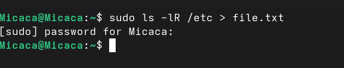
Рис. 1: Запись в файл

С помощью head я проверяю ,что в файл записалась названия файлов,
содержащихся в каталоге /etc:

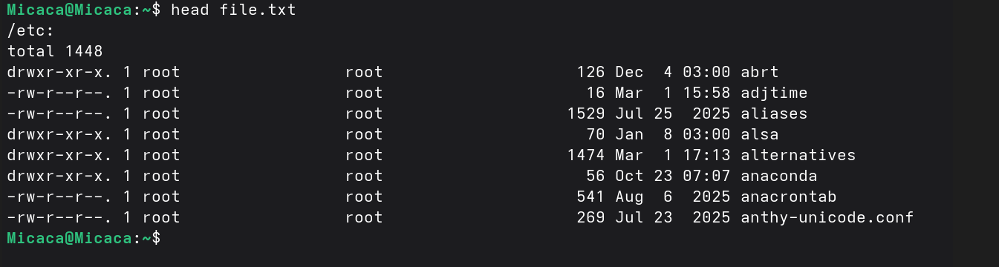
Рис. 2: Первые 8 файлов в file.txt

В file.txt добавляю названия файлов, из домашнего каталога используя ls
-lR /etc \>\> file.txt:

Рис. 3: Добавление файлов из домашнего
каталога

Вывожу имена всех файлов из file.txt, имеющих расширение .conf с помощью
grep:

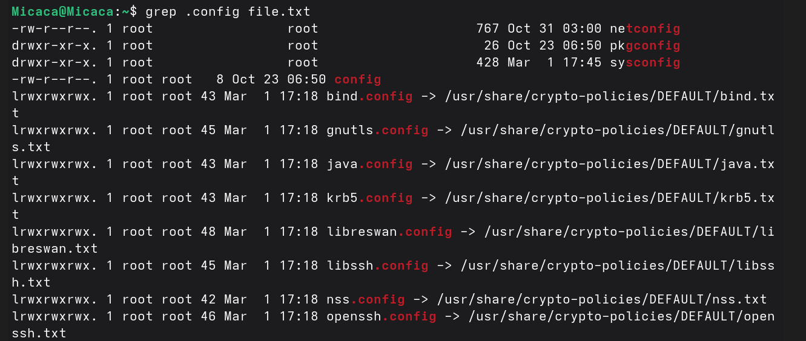
Рис. 4: файлы с расширением .conf

Затем запишиу их в новый текстовой файл conf.txt (grep .conf file.txt \>
conf.txt) и проверяю с помощью head:

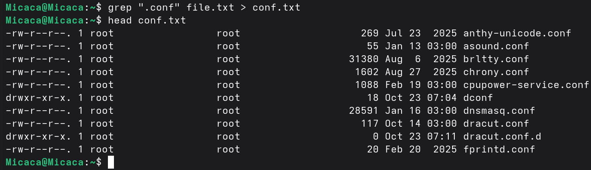
Рис. 5: добавление файлов с расширением
.conf

Чтобы определить, какие файлы в домашнем каталоге имеют имена,
начинавшиеся с символа "c", использую find \~ -name "c*" print ; \~
обозначается домашний каталог, -name (имя файлов) "с* " строка символов,
определяющая имя файла и print выводит результаты на экране:

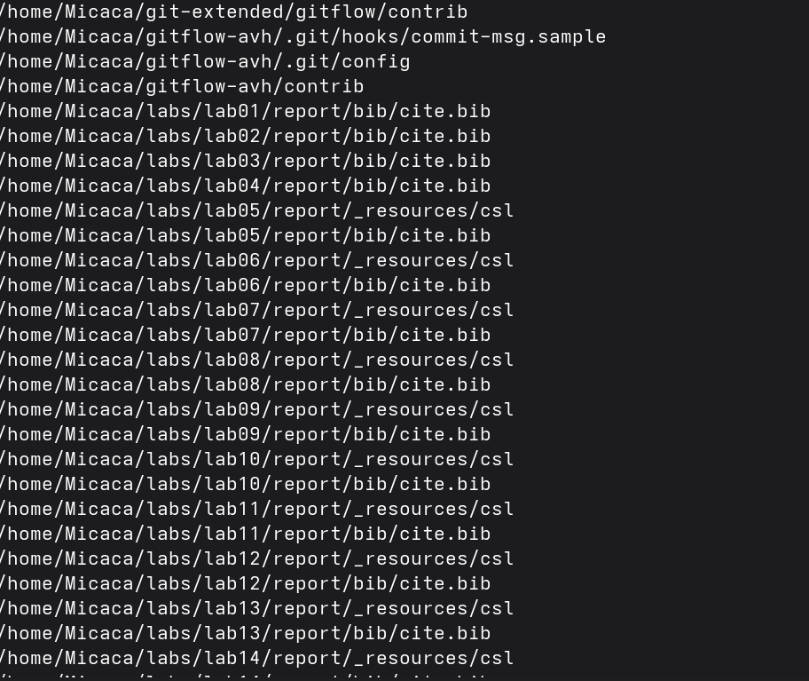
Рис. 6: файлы в домашнем каталоге начинающихся с
“с”

Также можно это действие выполнить используя ls -lR \| grep "c\*"

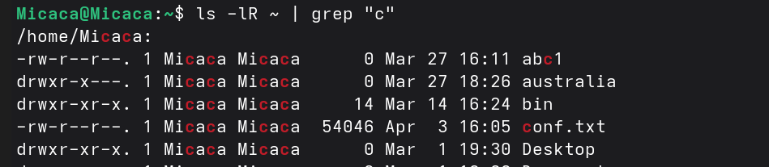
Рис. 7: поиск файла используя grep

с помощью find /etc -name "h\*" -print, вывожу файлы из каталога /etc,
начинающиеся с символа h:

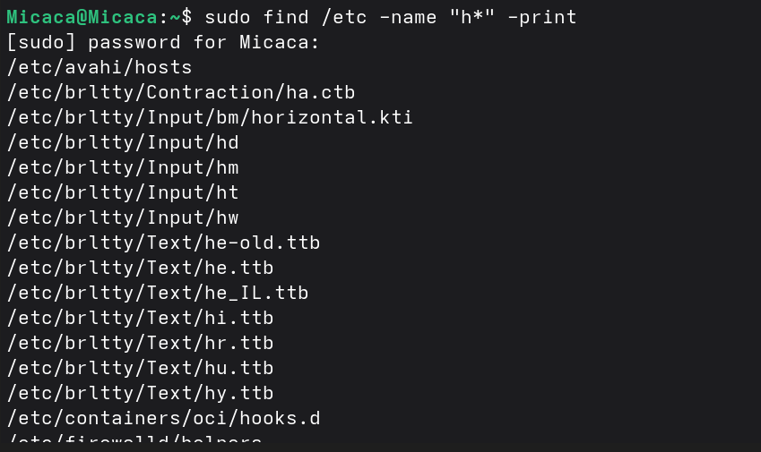
Рис. 8: файлы в etc начинающихся с “h”

В фоновом режиме запускаю процесс, который будет записывать в файл
\~/logfile файлы, имена которых начинаются с log:

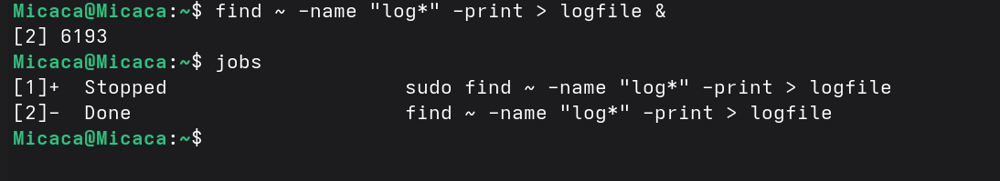
Рис. 9: Создание фонового режима

Удаляю созданный logfile и проверяю:

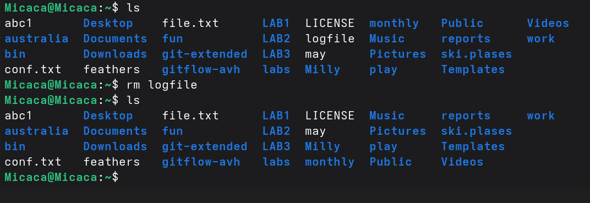
Рис. 10: удаление logfile

Запускаю из консоли в фоновом режиме редактор gedit указывая &:

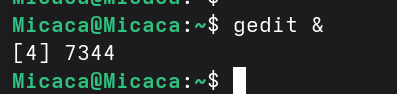
Рис. 11: запуск gedit в фоновом режиме

Используя команду ps, конвейер и фильтр grep, определяю идентификатор
процесса gedit (3576):

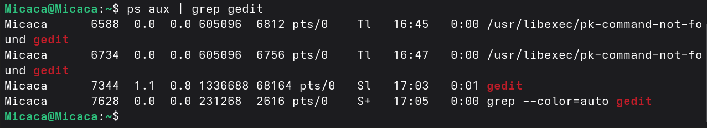
Рис. 12: идентификатор процесса gedit

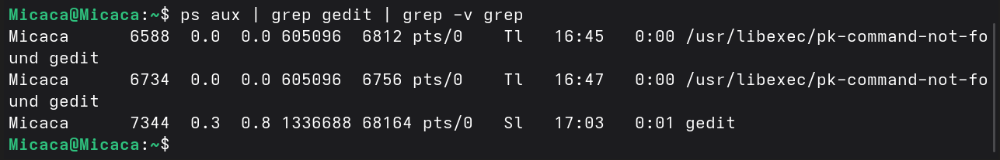
Рис. 13: Другой способ нахождение идентификатора
процесса

С помощью man прочитала справку команды kill и использую её для
завершения процесса gedit:

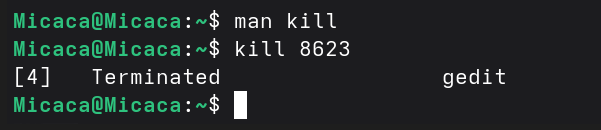
Рис. 14: завершения процесса gedit

С помощью man прочитала справку команд df и du:

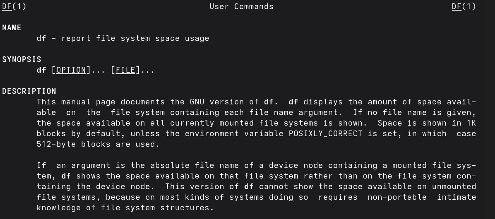
Рис. 15: справка команды df

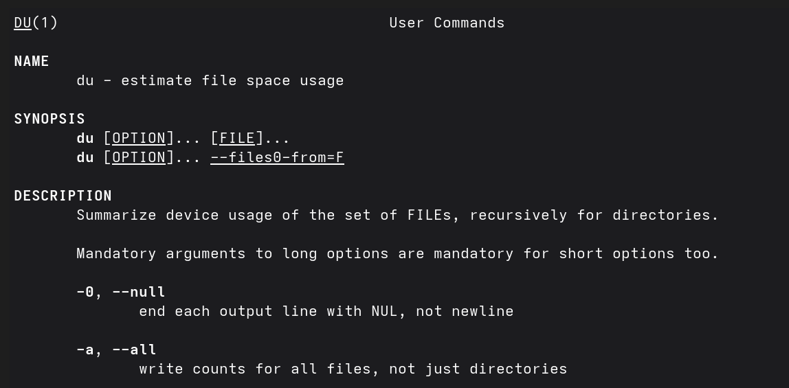
Рис. 16: справка команды du

Используя df -vi я вывожу информацию об инодах и вижу сколько свободного
места у моей системы:

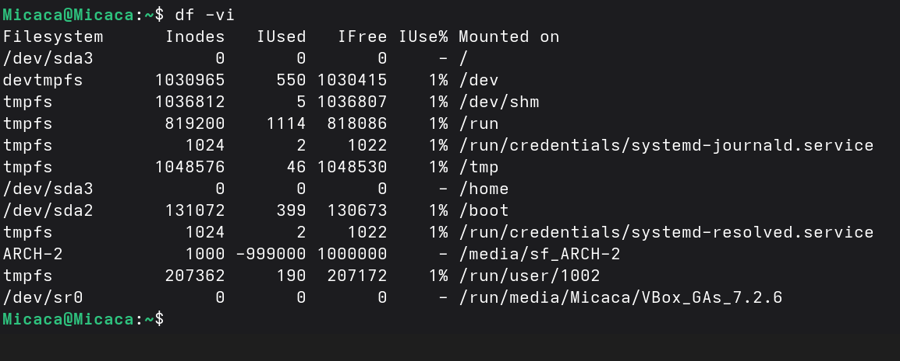
Рис. 17: df -vi

Используя du -a вижу сколько места занимают файлы в директории Загрузки:

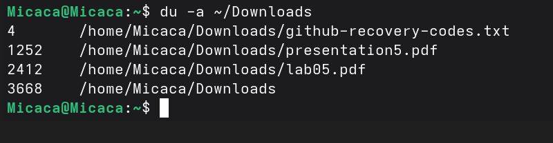
Рис. 18: du -a

Воспользовавшись справкой команды find и аргумент d, вывожу всех
директорий, имеющихся в домашнем каталоге:

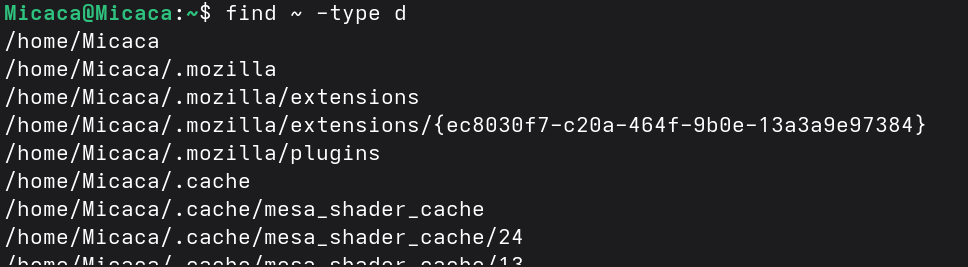
Рис. 19: Поиск директорий

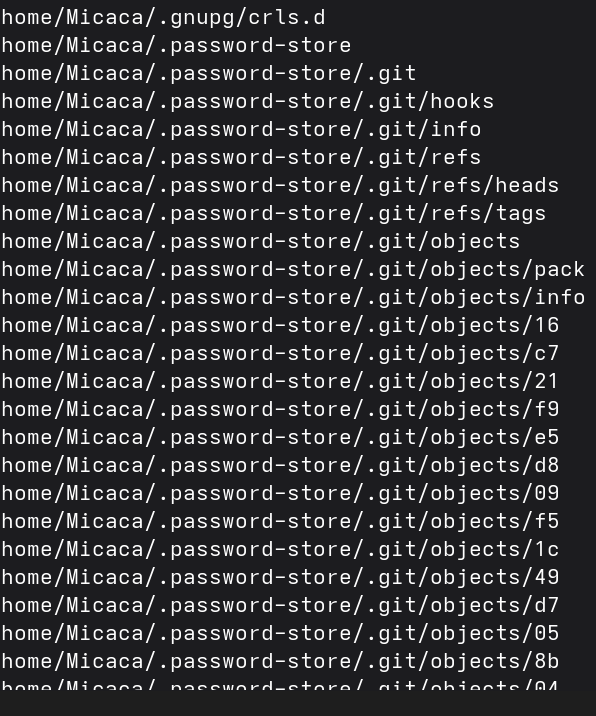
Рис. 20: результаты find ~ -type d

# 4 Выводы

При выполнение данной работы я ознакомилась с инструментами поиска
файлов и фильтрации текстовых данных. Также приобрела практические
навыки по управлению процессами и по проверке использования диска по
обслуживанию файловых систем.

# 5 Ответы на контрольные вопросы

1.  stdin --- стандартный поток ввода (по умолчанию: клавиатура),
    файловый дескриптор 0; stdout --- стандартный поток вывода (по
    умолчанию: консоль), файловый дескриптор 1; stderr --- стандартный
    поток вывод сообщений об ошибках (по умолчанию: консоль), файловый
    дескриптор 2

    - Перенаправление вывода (stdout) в файл "filename", \>\> файл
      открывается в режиме добавления.

2.  Конвейер (pipe) служит для объединения простых команд или утилит в
    цепочки, в которых результат работы предыдущей команды передаётся
    последующей.

3.  Программа - это набор инструкций, который позволяет ЦПУ выполнять
    определенную задачу, в то время как процесс - это исполняемая
    программа.

4.  PPID - (parent process ID) идентификатор родительского процесса.
    Процесс может порождать и другие процессы. UID, GID - реальные
    идентификаторы пользователя и его группы, запустившего данный
    процесс.

5.  Запущенные фоном программы называются задачами (jobs). Ими можно
    управлять с помощью команды jobs, которая выводит список запущенных
    в данный момент задач.

6.  Команда htop похожа на команду top по выполняемой функции: они обе
    показывают информацию о процессах в реальном времени, выводят данные
    о потреблении системных ресурсов и позволяют искать, останавливать и
    управлять процессами. У обеих команд есть свои преимущества.
    Например, в программе htop реализован очень удобный поиск по
    процессам, а также их фильтрация. В команде top это не так удобно
    --- нужно знать кнопку для вывода функции поиска.

7.  Команда find - это команда для поиска файлов и каталогов на основе
    специальных условий. Ее можно использовать в различных
    обстоятельствах, например, для поиска файлов по разрешениям,
    группам, типу, размеру и другим подобным критериям. Утилита find
    предустановлена по умолчанию во всех Linux дистрибутивах. Команда
    find имеет такой синтаксис: find \[папка\] \[параметры\] критерий
    шаблон \[действие\] Пример: find /etc -name "p\*" -print

8.  find / -type f -exec grep -H 'текстДляПоиска' {} ;

9.  df -h.

10. du -s.

11. kill% номер задачи.
