Студент: ТУЙИШИМЕ Тьерри

Группа: НКАбд-05-25

# Содержание {#содержание .TOC-Heading}

[1 Цель работы [2](#цель-работы)](#цель-работы)

[2 Задание [2](#задание)](#задание)

[3 Выполнение лабораторной работы
[2](#выполнение-лабораторной-работы)](#выполнение-лабораторной-работы)

[4 Задание по mc [2](#задание-по-mc)](#задание-по-mc)

[5 Задание по встроенному редактору mc
[9](#задание-по-встроенному-редактору-mc)](#задание-по-встроенному-редактору-mc)

[6 Выводы [12](#выводы)](#выводы)

[7 Ответы на контрольные вопросы
[12](#ответы-на-контрольные-вопросы)](#ответы-на-контрольные-вопросы)

# 1 Цель работы

Освоение основных возможностей командной оболочки Midnight Commander.
Приобретение навыков практической работы по просмотру каталогов и
файлов; манипуляций с ними.

# 2 Задание

1.  Задание по mc
2.  Задание по встроенному редактору mc

# 3 Выполнение лабораторной работы

# 4 Задание по mc

Вызвав в коммандной строке man mc, я прочитала информацию о mc:

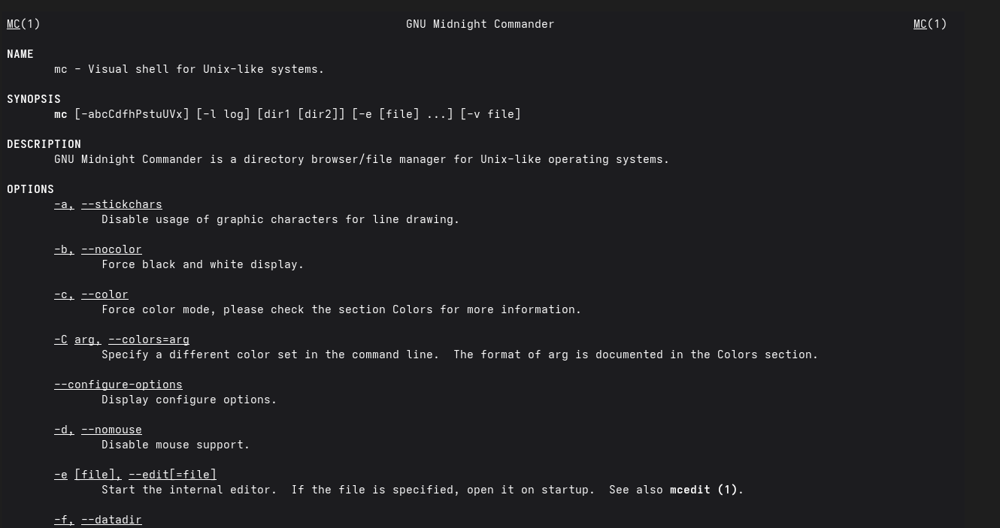

Рис. 1: Информация о mc

Я запускала mc, изучала его структуру и меню:

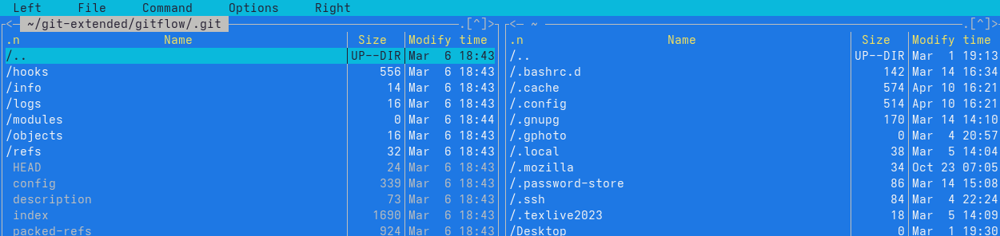

Рис. 2: Командная оболочка mc

Используя управляющие клавиши я; скопировала файл README.md в домашний
каталог:

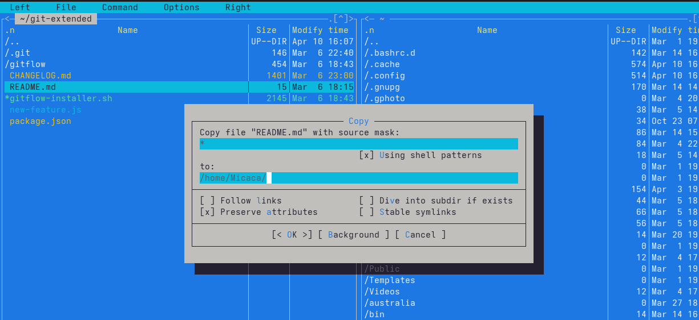

Рис. 3: Копирование файла

Создала файл new в \~/work/blog и удалила его:

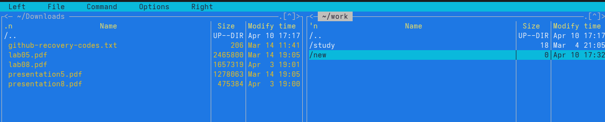

Рис. 4: Созданный файл

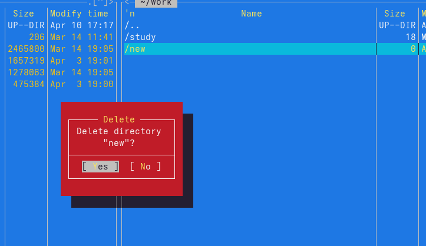

Рис. 5: Удаление файла

Получила информацию о размере и правах доступа на файл README.md:

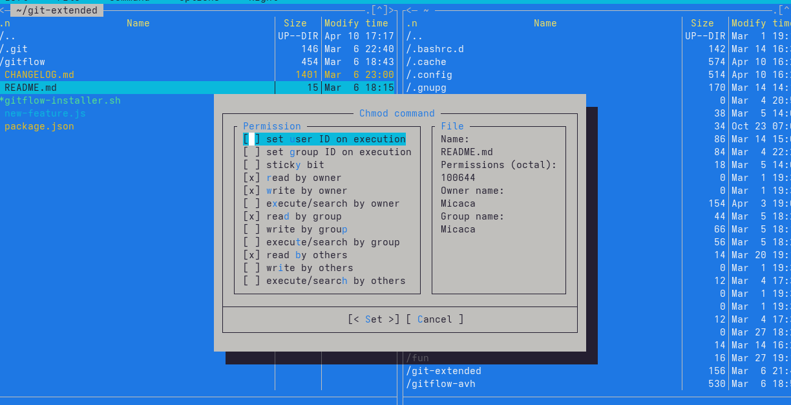

Рис. 6: Информация о README.md

В правой панели вывела информацию о файле. При этом я получаю больше
информации чем в выводе ls:

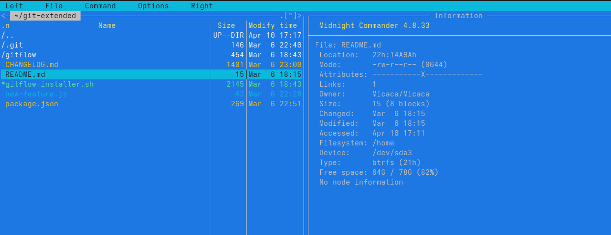

Рис. 7: Информфцию о файле

Используя возможности подменю Файл; я посмотрела содержаемые текстового
файла:

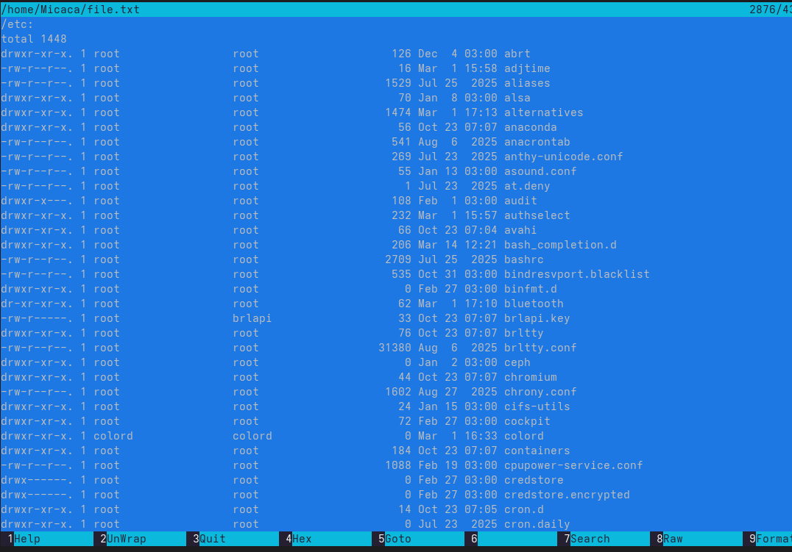

Рис. 8: Содержаемые файла

редактировала содержаемые текстового файла (abrt на mi):

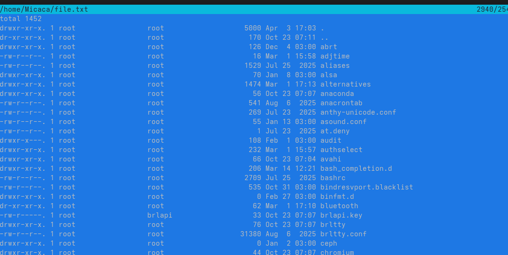

Рис. 9: Редактирование файла

Создала новый каталог:

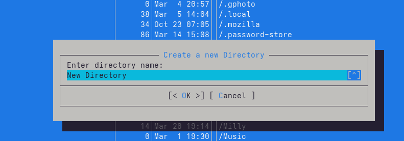

Рис. 10: создание каталога

и скопировала файл в ,только что созданный каталог:

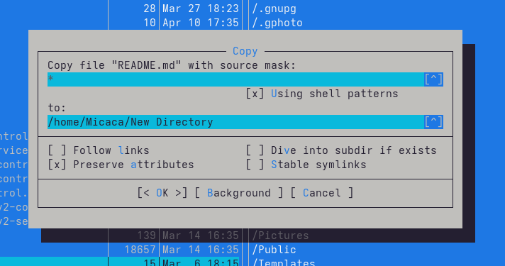

Рис. 11: копирование файла

С помощью подменю команда можно найти в файловой системе файл с
заданными условиями:

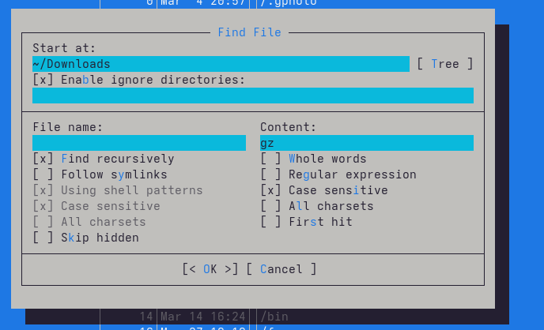

Рис. 12: файлы которые содержат gz

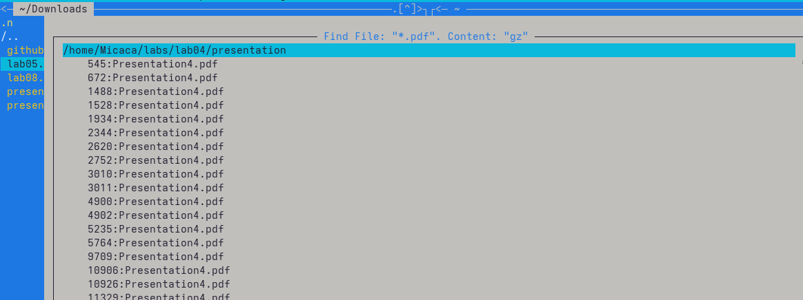

Рис. 13: результаты поиска

Исользуя подменю команда я повторила одну из предыдущих команд:

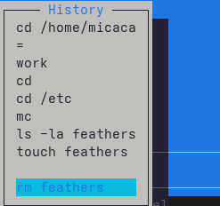

Рис. 14: повторение команды

Также перешла в домашний каталог и анализировала файл меню и файл
расширения:

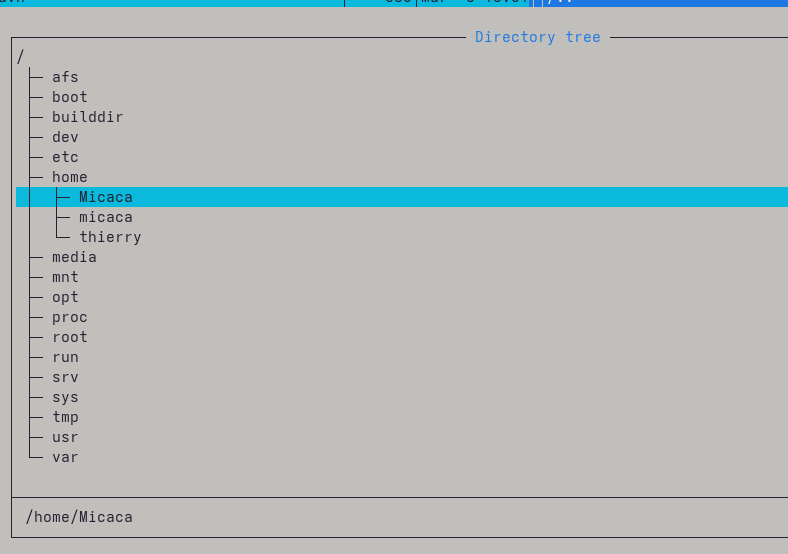

Рис. 15: Переход в домашний каталог

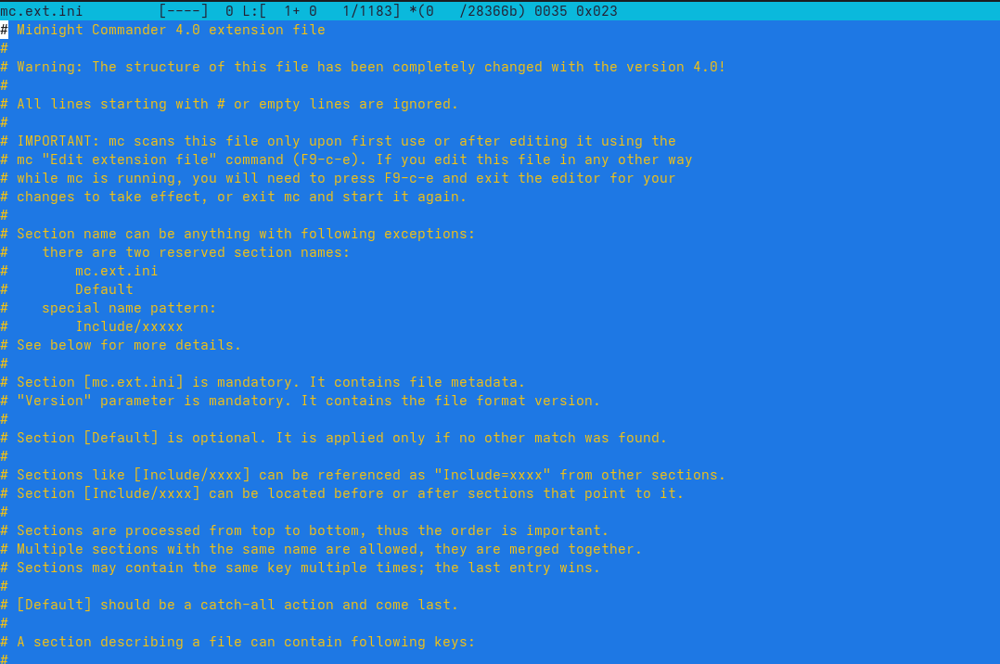

Рис. 16: файл расширения

Из подменю настройка вызвала окна настройки панели:

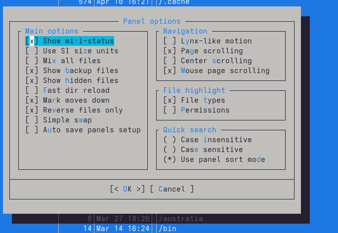

Рис. 17: Настройка панели

Настройки внешнего вида:

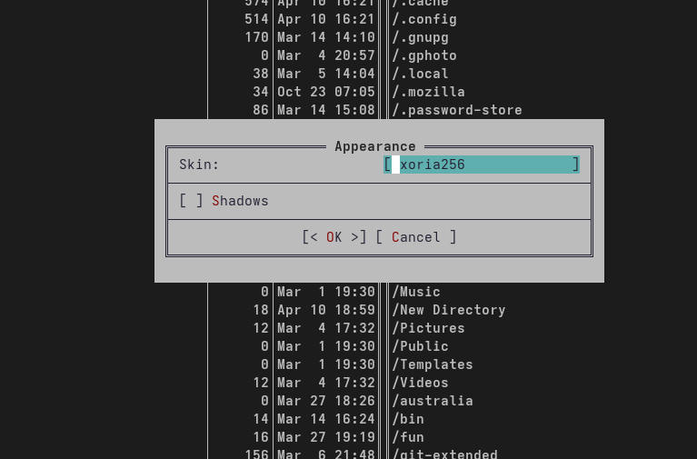

Рис. 18: Настройки внешнего вида

# 5 Задание по встроенному редактору mc

С помощью команды touch создала text.txt:

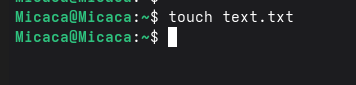

Рис. 19: Создание text.txt

Далее открыла его для редактирования с помощью f4 и с shift ctrl ins
вставила текст:

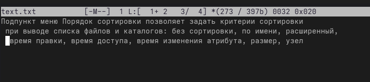

Рис. 20: Редактирование text.txt

С помощью f3 выделила текст и удалила выделеные слова f8:

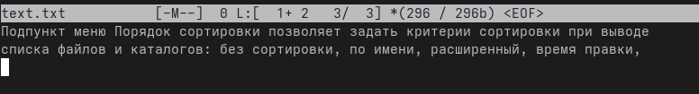

Рис. 21: Удаление текста

Перемещала выделенный текст с помощью f6:

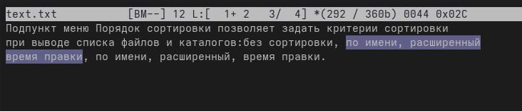

Рис. 22: Перемещение текста

Сохранила изменении с помощью f2:

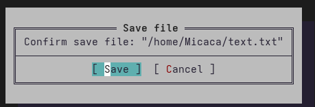

Рис. 23: Сохранение изменений в файле

С помощью ctrl-u отменила последнее действие:

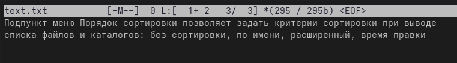

Рис. 24: Отменение последнего действия

Используя pg up и pg dn перешла в начало и конец файла и написала
некоторый текст. Затем сохранила и закрыла файл:

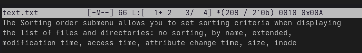

Рис. 25: Добавление текста

Открыла файл с исходным текстом на cpp:

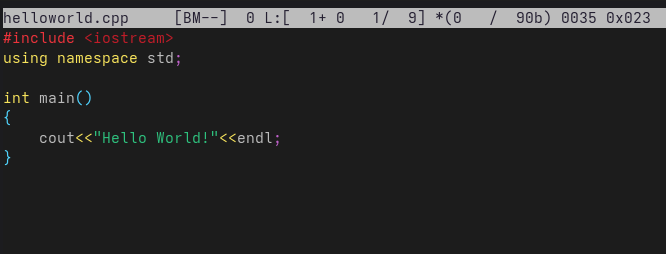

Рис. 26: файл cpp

Используя подменю команда я выключила подсветку синтаксиса:

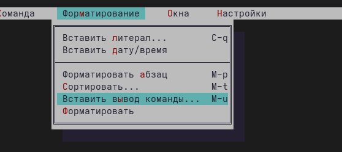

Рис. 27: Подменю команда

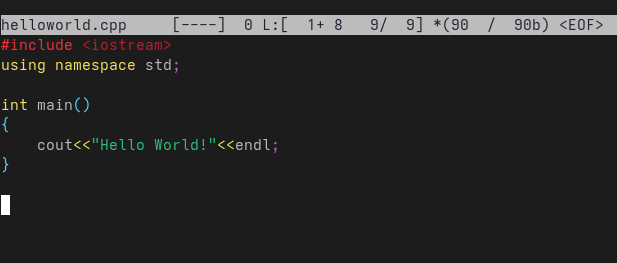

Рис. 28: подсветка синтаксиса

# 6 Выводы

При выполнении данной работы я освоила основные возможности командной
оболочки Midnight Commander, приобретела навыки практической работы по
просмотру каталогов и файлов; манипуляций с ними.

# 7 Ответы на контрольные вопросы

1.  Панели могут дополнительно быть переведены в один из двух режимов:
    Информация или Дерево. В режиме Информация на панель выводятся
    сведения о файле и текущей файловой системе, расположенных на
    активной панели. В режиме Дерево на одной из панелей выводится
    структура дерева каталогов.

2.  В разделе Командная строка оболочки (Shell) перечисляются команды и
    комбинации клавиш, которые используются для ввода и редактирования
    команд в командной строке оболочки. Большая часть этих команд служит
    для переноса имен файлов и/или имен каталогов в командную строку
    (чтобы уменьшить трудоемкость ввода) или для доступа к истории
    команд. Клавиши редактирования строк ввода используются как при
    редактировании командной строки, так и других строк ввода,
    появляющихся в различных запросах программы. Как с помощью меню так
    и с помощью команд shell можно переносить, копировать и получать
    информацию о файоах и каталогах.

3.  В меню каждой (левой или правой) панели можно выбрать Формат списка:

стандартный --- выводит список файлов и каталогов с указанием размера и
времени правки; ускоренный --- позволяет задать число столбцов, на
которые разбивается панель при выводе списка имён файлов или каталогов
без дополнительной информации; расширенный --- помимо названия файла или
каталога выводит сведения о правах доступа, владельце, группе, размере,
времени правки; определённый пользователем --- позволяет вывести те
сведения о файле или каталоге, которые задаст сам пользователь.

4.  В меню Файл содержит перечень команд, которые могут быть применены к
    одному или нескольким файлам или каталогам. Команды меню Файл:

Просмотр ( F3 ) --- позволяет посмотреть содержимое текущего (или
выделенного) файла без возможности редактирования. Просмотр вывода
команды ( М + ! ) --- функция запроса команды с параметрами (аргумент к
текущему выбранному файлу). Правка ( F4 ) --- открывает текущий (или
выделенный) файл для его редактирования. Копирование ( F5 ) ---
осуществляет копирование одного или нескольких файлов или каталогов в
указанное пользователем во всплывающем окне место. Права доступа (
Ctrl-x c ) --- позволяет указать (изменить) права доступа к одному или
нескольким файлам или каталогам . Жёсткая ссылка ( Ctrl-x l ) ---
позволяет создать жёсткую ссылку к текущему (или выделенному) файлу.
Символическая ссылка ( Ctrl-x s ) --- позволяет создать символическую
ссылку к текущему (или выделенному) файлу. Владелец/группа ( Ctrl-x o )
--- позволяет задать (изменить) владельца и имя группы для одного или
нескольких файлов или каталогов. Права (расширенные) --- позволяет
изменить права доступа и владения для одного или нескольких файлов или
каталогов. Переименование ( F6 ) --- позволяет переименовать (или
переместить) один или несколько файлов или каталогов. Создание каталога
( F7 ) --- позволяет создать каталог. Удалить ( F8 ) --- позволяет
удалить один или несколько файлов или каталогов. Выход ( F10 ) ---
завершает работу mc.

5.  В меню Команда содержатся более общие команды для работы с mc.
    Команды меню Команда:

Дерево каталогов --- отображает структуру каталогов системы. Поиск файла
--- выполняет поиск файлов по заданным параметрам. Переставить панели
--- меняет местами левую и правую панели. Сравнить каталоги ( Ctrl-x d )
--- сравнивает содержимое двух каталогов. Размеры каталогов ---
отображает размер и время изменения каталога (по умолчанию в mc размер -
каталога корректно не отображается). История командной строки ---
выводит на экран список ранее выполненных в оболочке команд. Каталоги
быстрого доступа ( Ctrl- ) --- пр вызове выполняется быстрая смена
текущего каталога на один из заданного списка. Восстановление файлов ---
позволяет восстановить файлы на файловых системах ext2 и ext3.
Редактировать файл расширений --- позволяет задать с помощью
определённого синтаксиса действия при запуске файлов с определённым
расширением (например, какое программного обеспечение запускать для
открытия или редактирования файлов с расширением doc или docx).
Редактировать файл меню --- позволяет отредактировать контекстное меню
пользователя, вызываемое по клавише F2 . Редактировать файл расцветки
имён --- позволяет подобрать оптимальную для пользователя расцветку имён
файлов в зависимости от их типа.

6.  Меню Настройки содержит ряд дополнительных опций по внешнему виду и
    функциональности mc. Меню Настройки содержит:

Конфигурация --- позволяет скорректировать настройки работы с панелями.
Внешний вид и Настройки панелей --- определяет элементы (строка меню,
командная строка, подсказки и прочее), отображаемые при вызове mc, а
также геометрию расположения панелей и цветовыделение. Биты символов ---
задаёт формат обработки информации локальным терминалом. Подтверждение
--- позволяет установить или убрать вывод окна с запросом подтверждения
действий при операциях удаления и перезаписи файлов, а также при выходе
из программы. Распознание клавиш --- диалоговое окно используется для
тестирования функциональных клавиш, клавиш управления курсором и прочее.
Виртуальные ФС ---- настройки виртуальной файловой системы: тайм-аут,
пароль и прочее.

7.  F1 Вызов контекстно-зависимой подсказки; F2 Вызов пользовательского
    меню с возможностью создания и/или дополнения дополнительных
    функций; F3 Просмотр содержимого файла, на который указывает
    подсветка в активной панели (без возможности редактирования); F4
    Вызов встроенного в mc редактора для изменения содержания файла, на
    который указывает подсветка в активной панели; F5 Копирование одного
    или нескольких файлов, отмеченных в первой (активной) панели, в
    каталог, отображаемый на второй панели; F6 Перенос одного или
    нескольких файлов, отмеченных в первой (активной) панели, в каталог,
    отображаемый на второй панели; F7 Создание подкаталога в каталоге,
    отображаемом в активной панели; F8 Удаление одного или нескольких
    файлов (каталогов), отмеченных в первой (активной) панели файлов; F9
    Вызов меню mc; F10 Выход из mc;

8.  Ctrl-y удалить строку; Ctrl-u отмена последней операции; Ins
    вставка/замена; F7 поиск (можно использовать регулярные выражения);
    (стрелочка вверх)-F7 повтор последней операции поиска; F4 замена; F3
    первое нажатие --- начало выделения, второе --- окончание выделения;
    F5 копировать выделенный фрагмент; F6 переместить выделенный
    фрагмент; F8 удалить выделенный фрагмент; F2 записать изменения в
    файл; F10 выйти из редактора.

9.  Можете сохранить часто используемые команды панелизации под
    отдельными информативными именами, чтобы иметь возможность их быстро
    вызвать по этим именам. Для этого нужно набрать команду в строке
    ввода (строка "Команда") и нажать кнопку Добавить. После этого
    потребуется ввести имя, по которому мы будем вызывать команду. В
    следующий раз вам достаточно будет выбрать нужное имя из списка, а
    не вводить всю команду заново.

10. Панель в mc отображает список файлов текущего каталога. Абсолютный
    путь к этому каталогу отображается в заголовке панели. У активной
    панели заголовок и одна из её строк подсвечиваются. Управление
    панелями осуществляется с помощью определённых комбинаций клавиш или
    пунктов меню mc.
