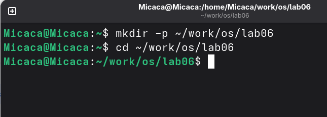
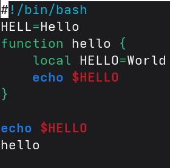
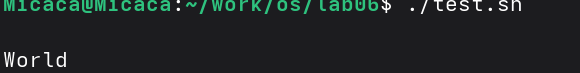
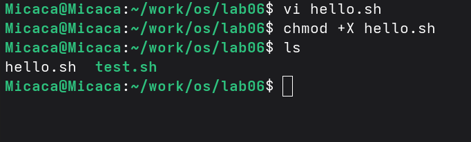
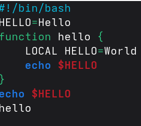
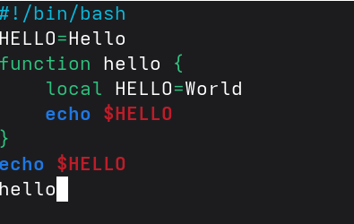
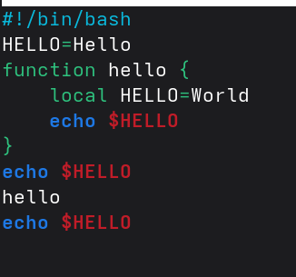
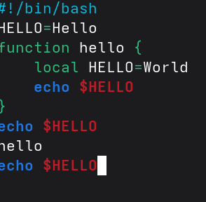
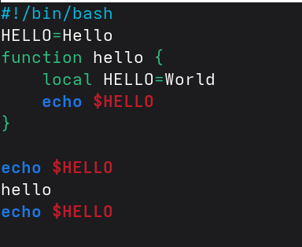

Студент: ТУЙИШИМЕ Тьерри

Группа: НКАбд-05-25

**\
**

# Содержание {#содержание .TOC-Heading}

[1 Цель работы [1](#цель-работы)](#цель-работы)

[2 Задание [1](#задание)](#задание)

[3 Выполнение лабораторной работы
[1](#выполнение-лабораторной-работы)](#выполнение-лабораторной-работы)

[3.1 Создание нового файла с использованием vi
[1](#создание-нового-файла-с-использованием-vi)](#создание-нового-файла-с-использованием-vi)

[3.2 Редактирование существующего файла
[2](#редактирование-существующего-файла)](#редактирование-существующего-файла)

[4 Выводы [4](#выводы)](#выводы)

[5 Ответы на контрольные вопросы
[4](#ответы-на-контрольные-вопросы)](#ответы-на-контрольные-вопросы)

[]{#цель-работы .anchor}

# 1 Цель работы {#цель-работы-1}

Получить практические навыки работы с редактором vi, установленным по
умолчанию практически во всех дистрибутивах Linux.

# 2 Задание

1.  Создание нового файла с использованием vi
2.  Редактирование существующего файла

# 3 Выполнение лабораторной работы

## 3.1 Создание нового файла с использованием vi

Снчала я создала каталог с именем \~/work/os/lab06 и перешла в нем:

Рис. 1: Создание каталога

Вызвала vi и создала файл hello.sh одновременно. Перешла в режим вставки
с помощью клавиши i и вводила текст:

Рис. 2: режим вставки

Используя клавиши esc я перешла в команднный режим, затем нажимала : для
перехода в режим последней строки. Затем я записала и вышла из vi
используя w, q и enter:

Рис. 3: Сохранение файла

С помощью chmod +х создаю исполняемый файл:

Рис. 4: Исполняеммый файл

## 3.2 Редактирование существующего файла

Вызвала vi на редактирование файла, установила курсор в конец слова HELL
второй строки. Далее я перешла в режим вставки и заменила на HELLO.
После этого я вернулась в командный режим:

Рис. 5: Перемешение курсора

Я перешла в режим вставки с помощью клавишы i, установила курсор на
четвертую строку и сотрила слово LOCAL, перешла в режим вставки и
вводила текст local. После этого я вернулась в командный режим:

Рис. 6: Заменение текста

Я перешла в режим вставки, установила курсор на последней строке файла и
вставила после неё строку, содержащую текст echo \$HELLO. Далее перешла
в командный режим:

Рис. 7: вставка текста

Я удалила последнюю строку:

Рис. 8: Удаление строки

С помощью клавиши u, я отменила последнее действие. Я нажимала : для
перехода в режим последней строки и вышла из vi:

{width="2.3779199475065615in"
height="1.9444444444444444in"}

Рис. 9: Отмена дествия

# 4 Выводы

При выполнении данной работы я получила практические навыки работы с
редактором vi.

# 5 Ответы на контрольные вопросы

1.  командный режим --- предназначен для ввода команд редактирования и
    навигации по редактируемому файлу; режим вставки --- предназначен
    для ввода содержания редактируемого файла; режим последней (или
    командной) строки --- используется для записи изменений в файл и
    выхода из редактора.

2.  Можно нажимать символ q (или q!), если требуется выйти из редактора
    без сохранения.

3.  0 (ноль) --- переход в начало строки; \$ --- переход в конец строки;
    G --- переход в конец файла; n G --- переход на строку с номером n.

4.  Редактор vi предполагает, что слово - это строка символов, которая
    может включать в себя буквы, цифры и символы подчеркивания.

5.  С помощью G --- переход в конец файла

6.  Вставка текста -- а --- вставить текст после курсора; -- А ---
    вставить текст в конец строки; -- i --- вставить текст перед
    курсором; -- n i --- вставить текст n раз; -- I --- вставить текст в
    начало строки. Вставка строки -- о --- вставить строку под курсором;
    -- О --- вставить строку над курсором. Удаление текста -- x ---
    удалить один символ в буфер; -- d w --- удалить одно слово в буфер;
    -- d \$ --- удалить в буфер текст от курсора до конца строки; -- d 0
    --- удалить в буфер текст от начала строки до позиции курсора; -- d
    d --- удалить в буфер одну строку; -- n d d --- удалить в буфер n
    строк.Отмена и повтор произведённых изменений -- u --- отменить
    последнее изменение; -- . --- повторить последнее
    изменение.Копирование текста в буфер -- Y --- скопировать строку в
    буфер; -- n Y --- скопировать n строк в буфер; -- y w ---
    скопировать слово в буфер.Вставка текста из буфера -- p --- вставить
    текст из буфера после курсора; -- P --- вставить текст из буфера
    перед курсором. Замена текста -- c w --- заменить слово; -- n c w
    --- заменить n слов; -- c \$ --- заменить текст от курсора до конца
    строки; -- r --- заменить слово; -- R --- заменить текст. Поиск
    текста -- / текст --- произвести поиск вперёд по тексту указанной
    строки символов текст; -- ? текст --- произвести поиск назад по
    тексту указанной строки символов текст.

7.  Перейти в режим вставки.

8.  С помощью u --- отменить последнее изменение

9.  Режим последней строки --- используется для записи изменений в файл
    и выхода из редактора.

10. \$ --- переход в конец строки

11. Опции редактора vi позволяют настроить рабочую среду. Для задания
    опций используется команда set (в режиме последней строки): -- : set
    all --- вывести полный список опций; -- : set nu --- вывести номера
    строк; -- : set list --- вывести невидимые символы; -- : set ic ---
    не учитывать при поиске, является ли символ прописным или строчным.

12. В редакторе vi есть два основных режима: командный режим и режим
    вставки. По умолчанию работа начинается в командном режиме. В режиме
    вставки клавиатура используется для набора текста. Для выхода в
    командный режим используется клавиша Esc или комбинация Ctrl + c.
