Студент: ТУЙИШИМЕ Тьерри

Группа: НКАбд-05-25

# Содержание {#содержание .TOC-Heading}

[1 Цель работы [1](#цель-работы)](#цель-работы)

[2 Задание [1](#задание)](#задание)

[3 Выполнение лабораторной работы
[1](#выполнение-лабораторной-работы)](#выполнение-лабораторной-работы)

[4 Выводы [8](#выводы)](#выводы)

[5 Ответы на котрольные вопросы
[8](#ответы-на-котрольные-вопросы)](#ответы-на-котрольные-вопросы)

[]{#цель-работы .anchor}

# 1 Цель работы {#цель-работы-1}

Получить практические навыки работы с редактором Emacs.

# 2 Задание

1.  Выполнить основные команды emacs

# 3 Выполнение лабораторной работы

Для данной работы, мне надо была установить Emacs:

<figure>
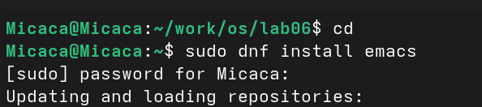
<figcaption>
Рис. 1: Установка Emacs
</figcaption>
</figure>

Выполнив Emacs в командной строке, я открыла текстовый редактор:

<figure>
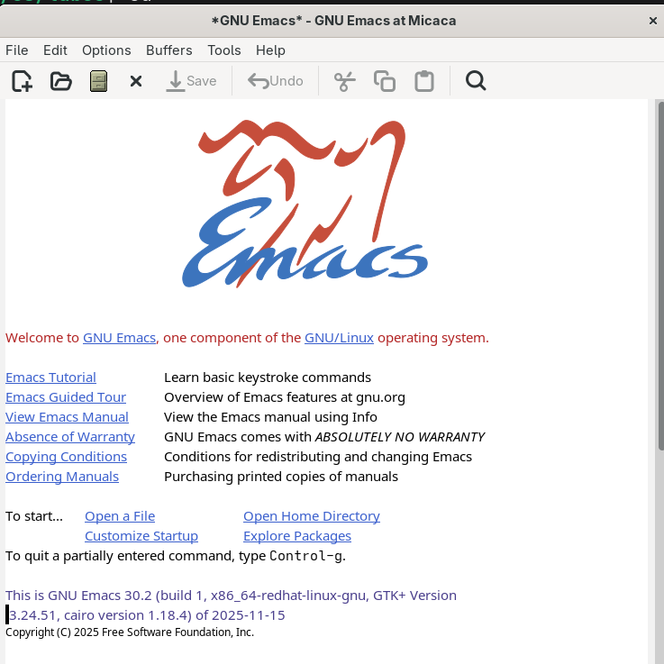
<figcaption>
Рис. 2: Emacs
</figcaption>
</figure>

С помощью комбинации Ctrl-x Ctrl-f, создала файл lab07.sh:

<figure>
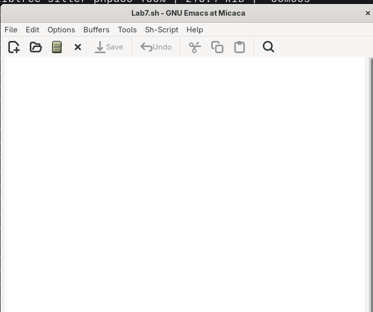
<figcaption>
Рис. 3: Созданный файл
</figcaption>
</figure>

Я написала некоторый текст в этом же файле (lab07.sh). После этого
сохранила файл с помощью комбинации Ctrl-x Ctrl-s:

<figure>
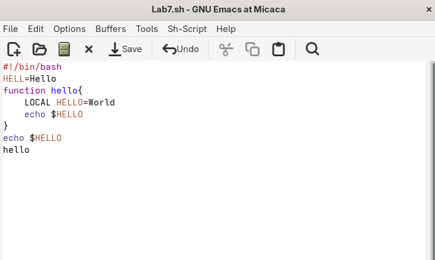
<figcaption>
Рис. 4: текст в lab07.sh
</figcaption>
</figure>

Одной командой вырезала целую строку (С-k):

<figure>
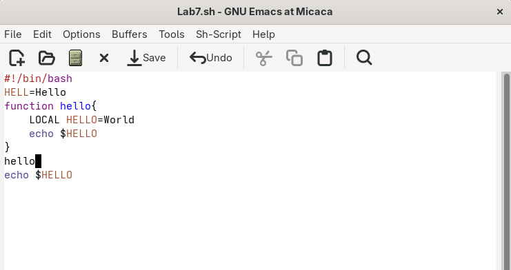
<figcaption>
Рис. 5: Вырезание строки
</figcaption>
</figure>

С помощью C-y вставила эту строку в конец файла:

<figure>
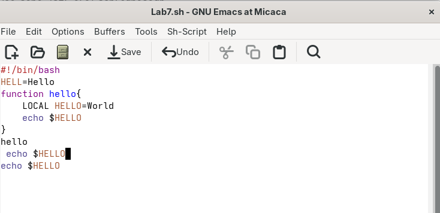
<figcaption>
Рис. 6: Перемешение строку в конец файла
</figcaption>
</figure>

Выделила область текста (C-space):

<figure>
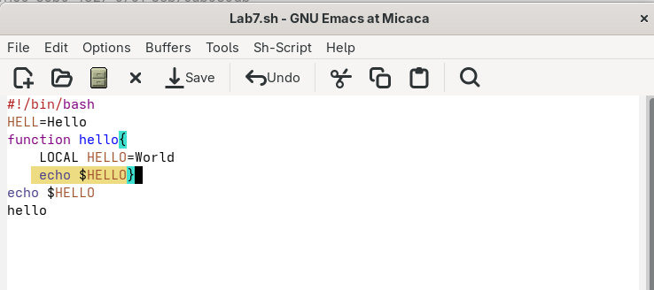
<figcaption>
Рис. 7: Выделенный текст
</figcaption>
</figure>

Скопировала область в буфер обмена (M-w) и вставила ее в конец файла:

{width="4.351551837270341in"
height="2.298611111111111in"}

Рис. 8: копирование и вставка

Выделила эту же область и на этот раз вырезала её (C-w):

<figure>
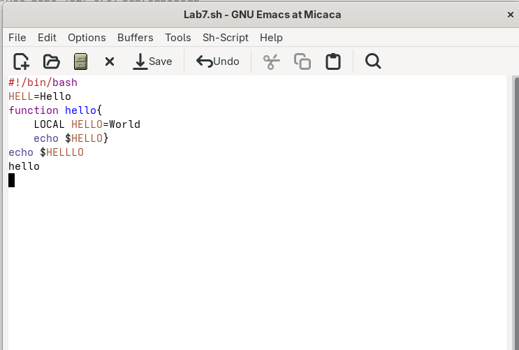
<figcaption>
Рис. 9: ВЫрезанная область
</figcaption>
</figure>

С помощью C-/ отменила последнее действие:

<figure>
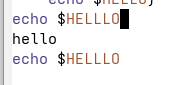
<figcaption>
Рис. 10: отмена действие
</figcaption>
</figure>

С помощью C-a переместила курсор в начало строки:

<figure>
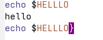
<figcaption>
Рис. 11: Перемещение курсор в начало
строки
</figcaption>
</figure>

С помощью C-e переместила курсор в конец строки:

<figure>
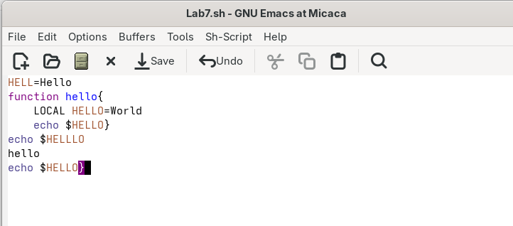
<figcaption>
Рис. 12: Перемещение курсор в конец
строки
</figcaption>
</figure>

Переместила курсор в начало и конец буфера с помощью M-\< и M-\>
соответственно:

<figure>

<figcaption>
Рис. 13: Перемешение курсор в буфере
</figcaption>
</figure>

Выводила список активных буферов на экран с помощью C-x C-b:

<figure>
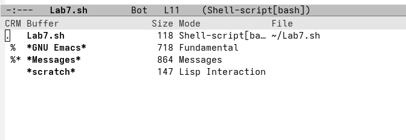
<figcaption>
Рис. 14: Активные буферы
</figcaption>
</figure>

С помощью C-x o переместилась во вновь открытое окно со списком открытых
буферов и переключилась на другой буфер:

<figure>
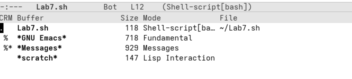
<figcaption>
Рис. 15: список открытых буферов
</figcaption>
</figure>

С помощью C-x 0 закрыла окно со списком открытых буферов:

<figure>
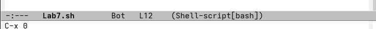
<figcaption>
Рис. 16: Закрытие окно
</figcaption>
</figure>

Без вывода списка буферов, я переключилась между буферами:

<figure>
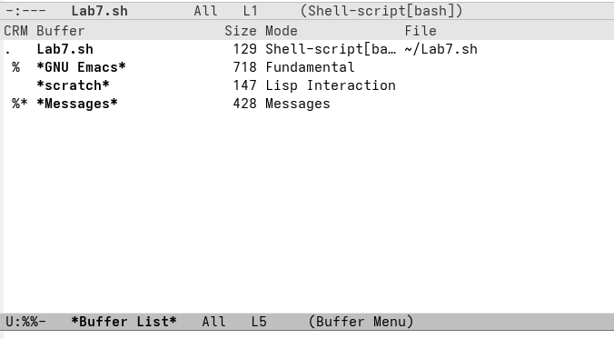
alt="Переключение между буферами" />
<figcaption>
Рис. 17: Переключение между буферами
</figcaption>
</figure>

<figure>
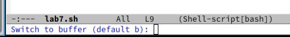
<figcaption>
Рис. 18: Новый буфер
</figcaption>
</figure>

Поделила фрейм на 4 части. Сначала я разделила фрейм на два окна по
вертикали (C-x 3), а затем каждое из этих окон на две части по
горизонтали (C-x 2):

<figure>
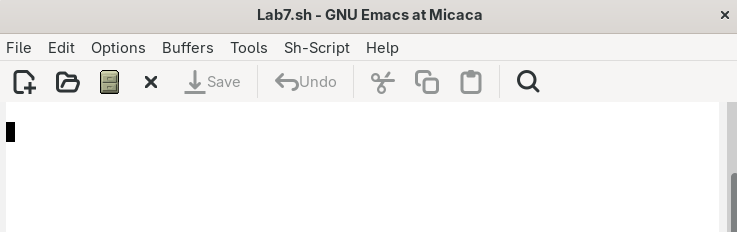
alt="Фрейм разделённый на 4 окна" />
<figcaption>
Рис. 19: Фрейм разделённый на 4 окна
</figcaption>
</figure>

В каждом из четырёх созданных окон открыла новый буфер:

<figure>
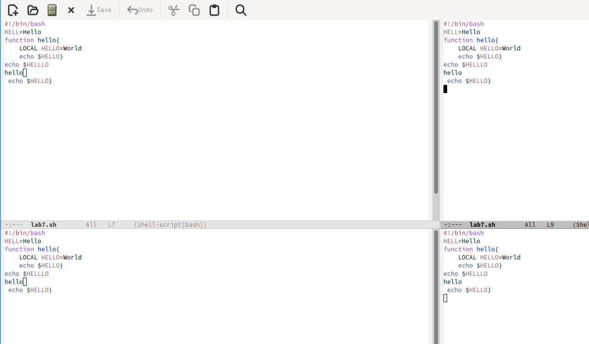
alt="Новые буферы" />
<figcaption>
Рис. 20: Новые буферы
</figcaption>
</figure>

Переключилась в режим поиска (C-s) и искала Indent:

<figure>
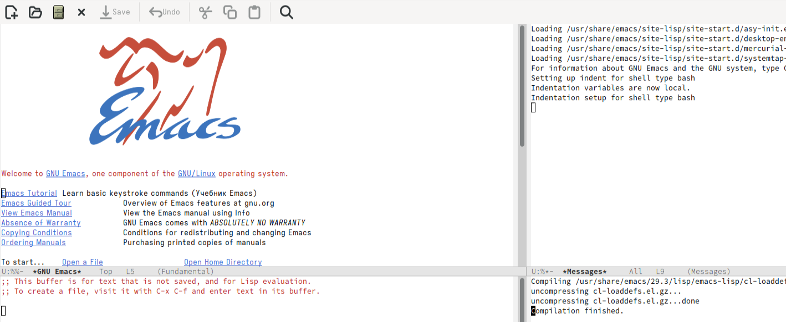
alt="Режим поиска" />
<figcaption>
Рис. 21: Режим поиска
</figcaption>
</figure>

Переключалась между результатами поиска, нажимая C-s и вышла из режима
поиска, нажав C-g:

<figure>
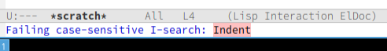
alt="Переключение между результатами" />
<figcaption>
Рис. 22: Переключение между результатами
</figcaption>
</figure>

Перешла в режим поиска и замены (M-%), искала слово World, нажмала
Enter, и заменила на Planet:

<figure>
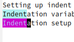
alt="Режим поиска" />
<figcaption>
Рис. 23: Режим поиска
</figcaption>
</figure>

Нажав M-s o, я использовала другой режим поиска. Он отличается от
предыдущего тем, что выводит результаты поиска в новом окне:

<figure>
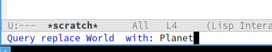
alt="другой режим поиска" />
<figcaption>
Рис. 24: другой режим поиска
</figcaption>
</figure>

<figure>
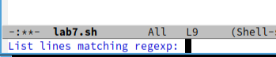
alt="Результаты поиска" />
<figcaption>
Рис. 25: Результаты поиска
</figcaption>
</figure>

# 4 Выводы

При выполнение данной работы я получила практические навыки работы с
Emacs.

# 5 Ответы на котрольные вопросы

1.  Emacs --- один из наиболее мощных и широко распространённых
    редакторов, используемых в мире UNIX. Написан на языке высокого
    уровня Lisp.

2.  Большое разнообразие сложных комбинаций клавиш, которые необходимы
    для редактирования файла и в принципе для работа с Emacs.

3.  Буфер - это объект в виде текста. Окно - это область, в которой
    отображен буфер.

4.  Да, можно.

5.  Emacs использует буферы с именами, начинающимися с пробела, для
    внутренних целей. Отчасти он обращается с буферами с такими именами
    особенным образом --- например, по умолчанию в них не записывается
    информация для отмены изменений.

6.  Ctrl + c, а потом \| и Ctrl + c Ctrl + \|

7.  С помощью команды Ctrl + x 3 (по вертикали) и Ctrl + x 2 (по
    горизонтали).

8.  Настройки emacs хранятся в файле . emacs, который хранится в
    домашней дирректории пользователя. Кроме этого файла есть ещё папка
    . emacs.

9.  Выполняет функцию стереть, думаю можно переназначить.

10. Для меня удобнее был редактор Emacs, так как у него есть командая
    оболочка. А vi открывается в терминале, и выглядит своеобразно.
