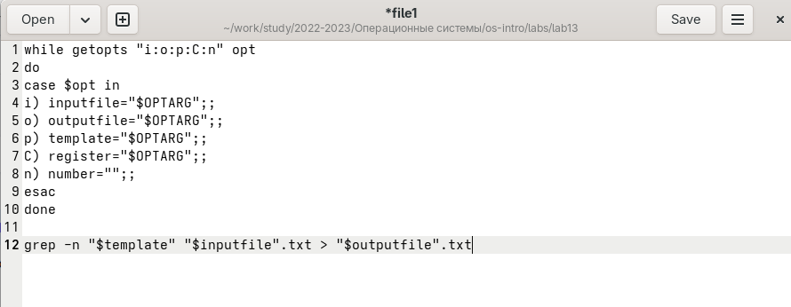
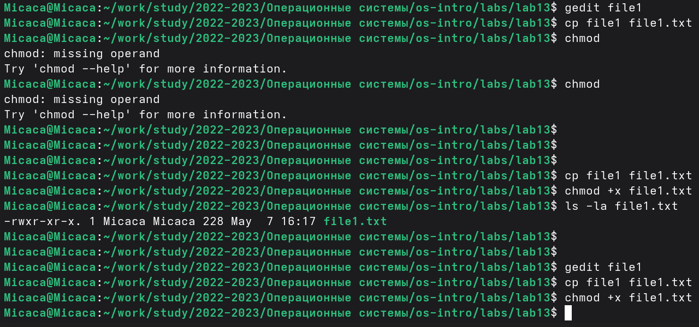
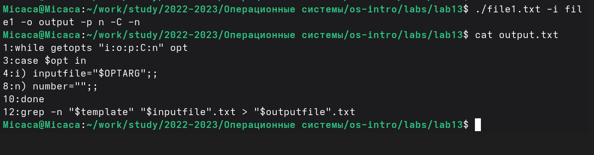
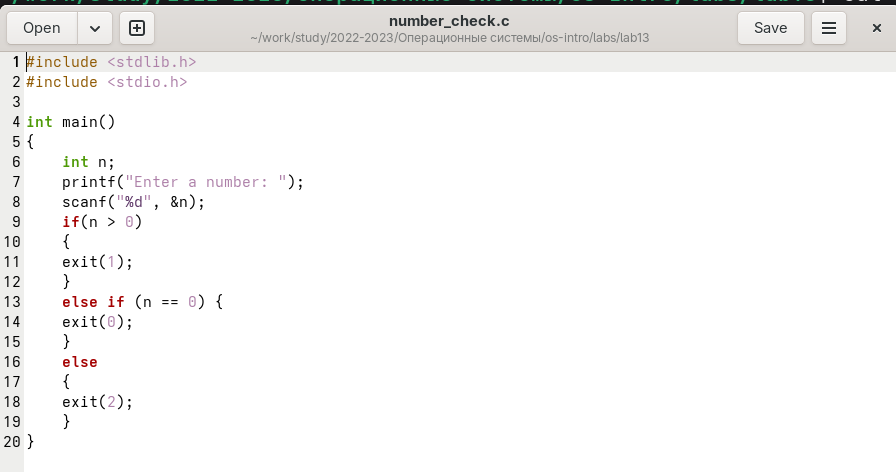
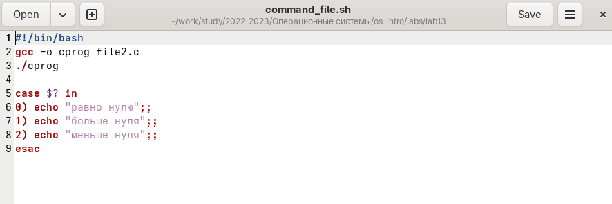
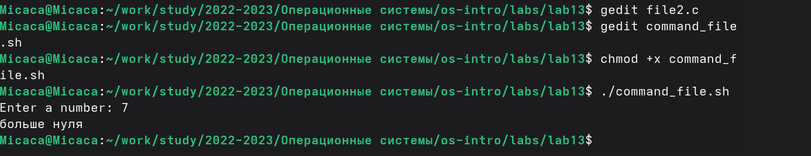
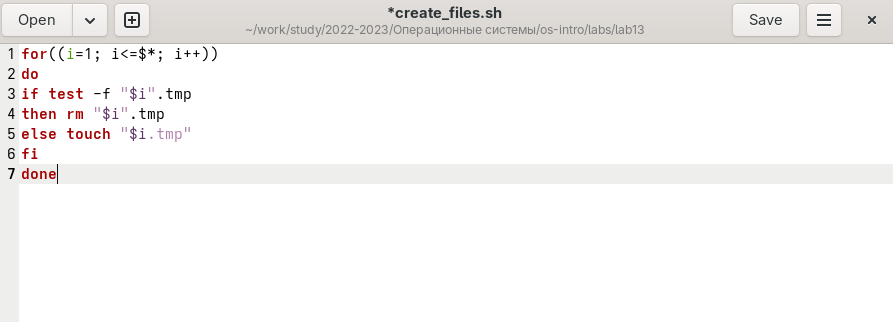
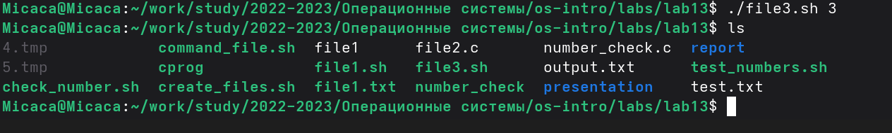
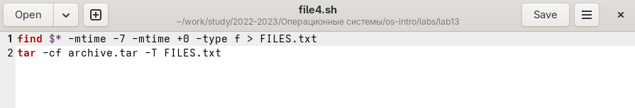
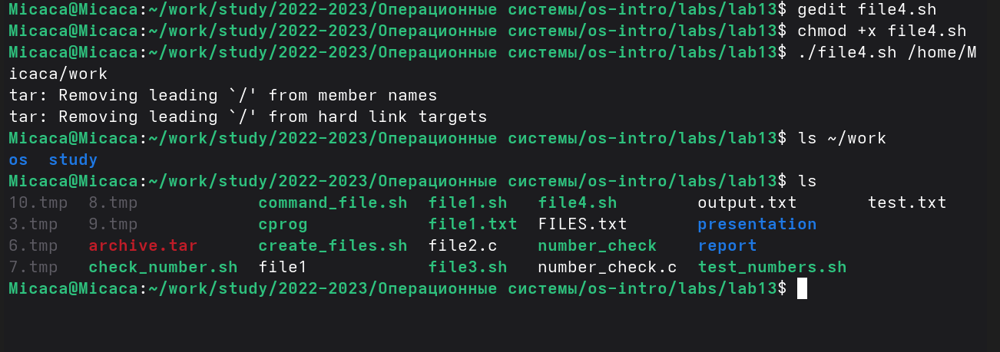

Студент: ТУЙИШИМЕ Тьерри

Группа: НКАбд-05-25

# Содержание {#содержание .TOC-Heading}

[1 Цель работы [1](#цель-работы)](#цель-работы)

[2 Задание [1](#задание)](#задание)

[3 Выполнение лабораторной работы
[2](#выполнение-лабораторной-работы)](#выполнение-лабораторной-работы)

[3.1 командный файл, который анализирует командную строку
[2](#командный-файл-который-анализирует-командную-строку)](#командный-файл-который-анализирует-командную-строку)

[3.2 программa, которая вводит число и определяет, является ли оно
больше нуля, меньше нуля или равно нулю.
[3](#программa-которая-вводит-число-и-определяет-является-ли-оно-больше-нуля-меньше-нуля-или-равно-нулю.)](#программa-которая-вводит-число-и-определяет-является-ли-оно-больше-нуля-меньше-нуля-или-равно-нулю.)

[3.3 командный файл, создающий указанное число файлов
[4](#командный-файл-создающий-указанное-число-файлов)](#командный-файл-создающий-указанное-число-файлов)

[3.4 командный файл, который с помощью команды tar запаковывает в архив
все файлы в указанной директории.
[5](#командный-файл-который-с-помощью-команды-tar-запаковывает-в-архив-все-файлы-в-указанной-директории.)](#командный-файл-который-с-помощью-команды-tar-запаковывает-в-архив-все-файлы-в-указанной-директории.)

[4 Выводы [6](#выводы)](#выводы)

[5 Ответы на контрольные вопросы
[6](#ответы-на-контрольные-вопросы)](#ответы-на-контрольные-вопросы)

[Список литературы [8](#список-литературы)](#список-литературы)

[]{#цель-работы .anchor}

# 1 Цель работы {#цель-работы-1}

Изучить основы программирования в оболочке ОС UNIX. Научится писать
более сложные командные файлы с использованием логических управляющих
конструкций и циклов.

# 2 Задание

1.  Используя команды getopts grep, написать командный файл, который
    анализирует командную строку
2.  Написать на языке Си программу, которая вводит число и определяет,
    является ли оно больше нуля, меньше нуля или равно нулю.
3.  Написать командный файл, создающий указанное число файлов,
    пронумерованных последовательно от 1 до N
4.  Написать командный файл, который с помощью команды tar запаковывает
    в архив все файлы в указанной директории.

# 3 Выполнение лабораторной работы

## 3.1 командный файл, который анализирует командную строку

Создаю файл file1 и в нем написала код, который анализирует командную
строку с ключами -i (прочитать данные из указанного файла), -o (вывести
данные в указанный файл), -p (указать шаблон для поиска), -C (различать
большие и малые буквы), -n (выдавать номера строк) используя команды
getopts grep:

<figure>

<figcaption>
Рис. 1: Код для анализирования командной
строки
</figcaption>
</figure>

    while getopts "i:o:p:C:n" opt
    do
    case $opt in
    i)inputfile="$OPTARG";;
    o)outputfile="$OPTARG";;
    p)template="$OPTARG";;
    c)register="$OPTARG";;
    n)number="";;
    esac
    done

    grep -n "$template" "$inputfile.txt" > "$outputfile.txt"

Далее я установила права на испонение и запустила файл:

<figure>

<figcaption>
Рис. 2: право на исполнение
</figcaption>
</figure>

{width="5.390212160979877in"
height="1.4097222222222223in"}

Рис. 3: Запуск file1

## 3.2 программa, которая вводит число и определяет, является ли оно больше нуля, меньше нуля или равно нулю.

Написала на языке Си программу, которая вводит число и определяет,
является ли оно больше нуля, меньше нуля или равно нулю. Затем программа
завершается с помощью функции exit(n), передавая информацию о коде
завершения в оболочку:

<figure>

<figcaption>
Рис. 4: Программа на языке Си
</figcaption>
</figure>

    #include <stdlib.h>
    #include <stdio.h>

    int main()
    {
        int n;
        printf("Enter a number: ");
        scanf("%d", &n);
        if(n>0)
        {
            exit(1);
        }   
        
        else if (n==0) {
            exit(0);}
        else
        {
        exit(2);
        }
    }

Далее создала командный файл который вызывает эту программу и,
проанализировав с помощью команды \$?, выдает сообщение о том, какое
число было введено:

<figure>

<figcaption>
Рис. 5: Командный файл программы на Си
</figcaption>
</figure>

    gcc -o cprog file2.c
    ./cprog

    case $? in
    0) echo "равно нулю";;
    1) echo "больше нуля";;
    2) echo "меньше нуля";;

    esac

Создала исполняемый файл и запустила:

<figure>

<figcaption>
Рис. 6: Результаты программы
</figcaption>
</figure>

## 3.3 командный файл, создающий указанное число файлов

Я написала командный файл, создающий указанное число файлов,
пронумерованных последовательно от 1 до 𝑁. Число файлов, которые
необходимо создать, передаётся в аргументы командной строки. Этот же
командный файл должен уметь удалять все созданные им файлы (если они
существуют):

<figure>

<figcaption>
Рис. 7: Командный файл для создания
файлов
</figcaption>
</figure>

    for((i=1; i<=$*; i++))
    do
    if test -f "$i".tmp
    then rm "$i".tmp
    else touch "$i.tmp"
    fi
    done

Создала исполняемый файл и запустила:

<figure>

<figcaption>
Рис. 8: Создание файлов с помощью командного
файла
</figcaption>
</figure>

## 3.4 командный файл, который с помощью команды tar запаковывает в архив все файлы в указанной директории.

создала командный файл, который с помощью команды tar запаковывает в
архив все файлы в указанной директории. Модифицировала его так, чтобы
запаковывались только те файлы, которые были изменены менее недели тому
назад (использовать команду find).

<figure>

<figcaption>
Рис. 9: Создание архива
</figcaption>
</figure>

    find $* -mtime -7 -mtime +0 -type f > FILES.txt
    tar -cf archive.tar -T FILES.txt

{width="5.595566491688539in"
height="1.9722222222222223in"}

Рис. 10: Результаты кода

# 4 Выводы

При выполнении проделанной работы я научилась писать более сложные
командные файлы с использованием логических управляющих конструкций и
циклов.

# 5 Ответы на контрольные вопросы

1.  Осуществляет синтаксический анализ командной строки, выделяя флаги,
    и используется для объявления переменных. Синтаксис команды
    следующий: getopts option-string variable. Флаги -- это опции
    командной строки, обычно помеченные знаком минус; Например, -F
    является флагом для команды ls -F. Иногда эти флаги имеют аргументы,
    связанные с ними. Программы интерпретируют эти флаги,
    соответствующим образом изменяя свое поведение. Строка опций
    option-string --- это список возможных букв и чисел соответствующего
    флага. Если ожидается, что некоторый флаг будет сопровождаться
    некоторым аргументом, то за этой буквой должно следовать двоеточие.
    Соответствующей переменной присваивается буква данной опции. Если
    команда getopts может распознать аргумент, она возвращает истину.
    Принято включать getopts в цикл while и анализировать введенные
    данные с помощью оператора case. Предположим, необходимо распознать
    командную строку следующего формата: testprog -ifile_in.txt
    -ofile_out.doc -L -t -r Вот как выглядит использование оператора
    getopts в этом случае: while getopts o:i:Ltr optletter do case
    $optletterino)oflag = 1;oval =$OPTARG;; i) iflag=1;
    ival=\$OPTARG;; L) Lflag=1;; t) tflag=1;; r) rflag=1;; \*) echo
    Illegal option \$optletter esac done Функция getopts включает две
    специальные переменные среды -- OPTARG и OPTIND. Если ожидается
    дополнительное значение, то OPTARG устанавливается в значение этого
    аргумента (будет равна file_in.txt для опции i и file_out.doc для
    опции o) . OPTIND является числовым индексом на упомянутый аргумент.
    Функция getopts также понимает переменные типа массив,
    следовательно, можно использовать ее в функции не только для
    синтаксического анализа аргументов функций, но и для анализа
    введенных пользователем данных.

2.  При перечислении имён файлов текущего каталога можно использовать
    следующие символы: − соответствует произвольной, в том числе и
    пустой строке; ? − соответствует любому одинарному символу;
    \[c1-c2\] − соответствует любому символу, лексикографически
    находящемуся между символами с1 и с2. Например, echo \* − выведет
    имена всех файлов текущего каталога, что представляет собой
    простейший аналог команды ls; ls .c − выведет все файлы с последними
    двумя символами, совпадающими с .c. echo prog.? − выведет все файлы,
    состоящие из пяти или шести символов, первыми пятью символами
    которых являются prog.. \[a-z\] − соответствует произвольному имени
    файла в текущем каталоге, начинающемуся с любой строчной буквы
    латинского алфавита.

3.  Часто бывает необходимо обеспечить проведение каких-либо действий
    циклически и управление дальнейшими действиями в зависимости
    отрезультатов проверки некоторого условия. Для решения подобных
    задач язык программирования bash предоставляет возможность
    использовать такие управляющие конструкции, как for, case, if и
    while. С точки зрения командного процессора эти управляющие
    конструкции являются обычными командами и могут использоваться как
    при создании командных файлов, так и при работе в интерактивном
    режиме. Команды, реализующие подобные конструкции, по сути, являются
    операторами языка программирования bash. Поэтому при описании языка
    программирования bash термин оператор будет использоваться наравне с
    термином команда. Команды ОС UNIX возвращают код завершения,
    значение которого может быть использовано для принятия решения о
    дальнейших действиях. Команда test, например, создана специально для
    использования в командных файлах. Единственная функция этой команды
    заключается в выработке кода завершения.

4.  Два несложных способа позволяют вам прерывать циклы в оболочке bash.
    Команда break завершает выполнение цикла, а команда continue
    завершает данную итерацию блока операторов. Команда break полезна
    для завершения цикла while в ситуациях, когда условие перестаёт быть
    правильным. Команда continue используется в ситуациях, когда больше
    нет необходимости выполнять блок операторов, но вы можете захотеть
    продолжить проверять данный блок на других условных выражениях.

5.  Следующие две команды ОС UNIX используются только совместно с
    управляющими конструкциями языка программирования bash: это команда
    true, которая всегда возвращает код завершения, равный нулю (т.е.
    истина), и команда false, которая всегда возвращает код завершения,
    не равный нулю (т. е. ложь).

6.  Строка if test -f man$s/$i.$sпроверяет,существуетлифайлman$s/$i.$s и
    является ли этот файл обычным файлом. Если данный файл является
    каталогом, то команда вернет нулевое значение (ложь).

7.  Выполнение оператора цикла while сводится к тому, что сначала
    выполняется последовательность команд (операторов), которую задаёт
    список-команд в строке, содержащей служебное слово while, а затем,
    если последняя выполненная команда из этой последовательности команд
    возвращает нулевой код завершения (истина), выполняется
    последовательность команд (операторов), которую задаёт список-команд
    в строке, содержащей служебное слово do, после чего осуществляется
    безусловный переход на начало оператора цикла while. Выход из цикла
    будет осуществлён тогда, когда последняя выполненная команда из
    последовательности команд (операторов), которую задаёт список-команд
    в строке, содержащей служебное слово while, возвратит ненулевой код
    завершения (ложь). При замене в операторе цикла while служебного
    слова while на until условие, при выполнении которого осуществляется
    выход из цикла, меняется на противоположное. В остальном оператор
    цикла while и оператор цикла until идентичны.

# Список литературы

[Архитектура
коипьютеров](https://esystem.rudn.ru/pluginfile.php/2288099/mod_resource/content/5/011-lab_shell_prog_2.pdf)
