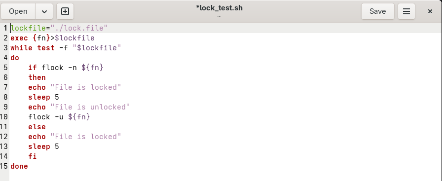
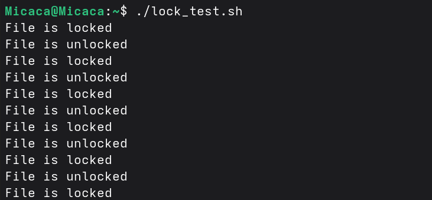
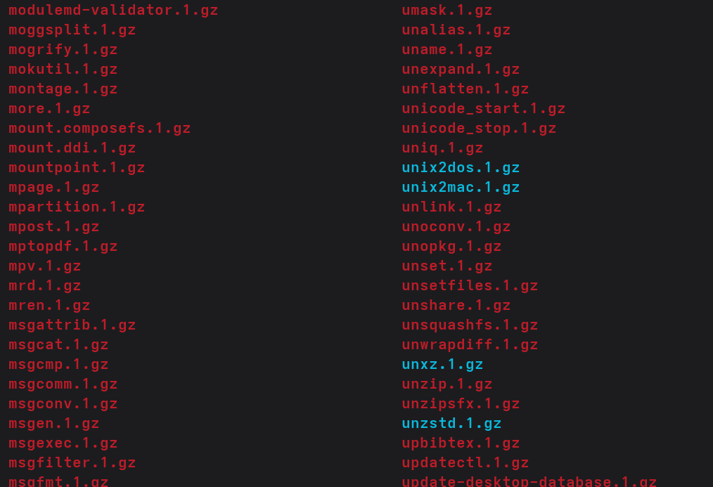
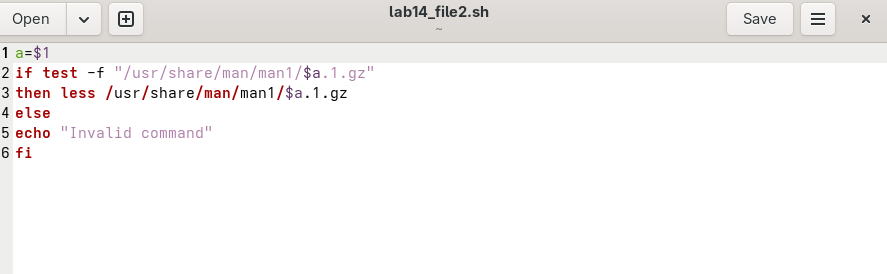
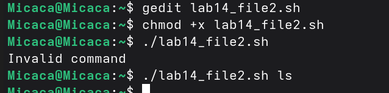
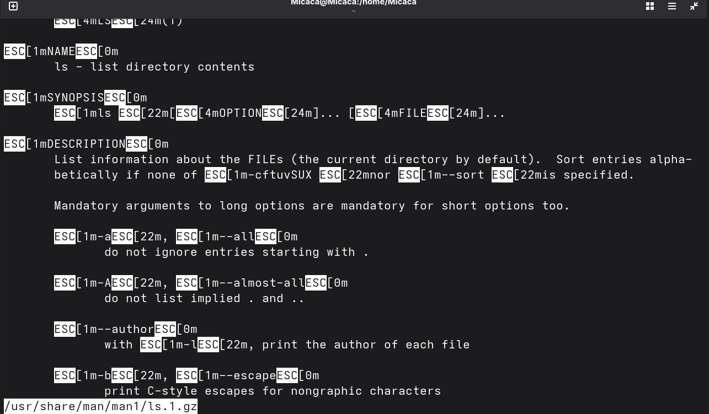
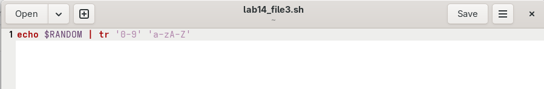
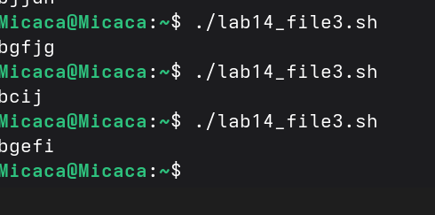

Факультет физико-математических и естественных наук

Кафедра прикладной информатики и теории вероятностей

Отчёт по лабораторной работе №14

Программирование в командном процессоре ОС UNIX. Расширенное
программирование

**Студент: ТУЙИШИМЕ Тьерри**

**Группа: НКАбд-05-25**

# Содержание {#содержание .TOC-Heading}

[1 Цель работы [2](#цель-работы)](#цель-работы)

[2 Задание [2](#задание)](#задание)

[3 Выполнение лабораторной работы
[2](#выполнение-лабораторной-работы)](#выполнение-лабораторной-работы)

[3.1 командный файл, реализующий упрощённый механизм семафоров
[2](#командный-файл-реализующий-упрощённый-механизм-семафоров)](#командный-файл-реализующий-упрощённый-механизм-семафоров)

[3.2 Реализовать команду man с помощью командного файла
[3](#реализовать-команду-man-с-помощью-командного-файла)](#реализовать-команду-man-с-помощью-командного-файла)

[3.3 написать командный файл, генерирующий случайную последовательность
букв латинского алфавита.
[5](#написать-командный-файл-генерирующий-случайную-последовательность-букв-латинского-алфавита.)](#написать-командный-файл-генерирующий-случайную-последовательность-букв-латинского-алфавита.)

[4 Выводы [5](#выводы)](#выводы)

[5 Ответы на контрольные вопросы
[5](#ответы-на-контрольные-вопросы)](#ответы-на-контрольные-вопросы)

[Список литературы [7](#список-литературы)](#список-литературы)

# 1 Цель работы

Изучить основы программирования в оболочке ОС UNIX. Научиться писать
более сложные командные файлы с использованием логических управляющих
конструкций и циклов.

# 2 Задание

1.  Написать командный файл, реализующий упрощённый механизм семафоров.
2.  Реализовать команду man с помощью командного файла.
3.  Используя встроенную переменную \$RANDOM, написать командный файл,
    генерирующий случайную последовательность букв латинского алфавита.

# 3 Выполнение лабораторной работы

## 3.1 командный файл, реализующий упрощённый механизм семафоров

Чтобы создать данный командный файл, я создала новый файл и написала в
нем некоторый скрипт. Он устанавливает переменную lockfile для пути к
файлу блокировки, открывает файл для записи и назначает ему дескриптор
файла. Далее входит в цикл, который выполняется, пока файл блокировки
существует. Пытается получить эксклусивную блокировку для файла. Если
это удается, выводит "file locked", ждет 5 секунд а затем выводит "file
unlocked":

<figure>

<figcaption>
Рис. 1: упрощённый механизм семафоров
(код)
</figcaption>
</figure>

    lockfile="./lock.file"
    exec {fn}>$lockfile

    while test -f "$lockfile"
    do
    if flock -n ${fn}
    then
        echo "File is locked"
        sleep 5
        echo "File is unlocked"
        flock -u ${fn}
    else
        echo "File is locked"
        sleep 5

    fi
    done    

<figure>

<figcaption>
Рис. 2: результаты кода
</figcaption>
</figure>

## 3.2 Реализовать команду man с помощью командного файла

Я изучила содержимое каталога /usr/share/man/man1. В нем находятся
архивы текстовых файлов, содержащих справку по большинству установленных
в системе программ и команд:

<figure>

<figcaption>
Рис. 3: ls /usr/share/man/man1
</figcaption>
</figure>

Потом я создала файл и в нем написала скрипт реализирующий команды man.
Он принимает аргумент \$1, проверяет существование файла в
/usr/share/man/man1, и если файл существует, использует less для
отображения содержимого сжатой страницы руководства. Если файл не
существует, выводит "invalid command":

<figure>

<figcaption>
Рис. 4: командный файл man
</figcaption>
</figure>

    a=$1
    if test -f "/usr/share/man/man1/$a.1.gz"
    then less /usr/share/man/man1/$a.1.gz
    else
    echo "Invalid command"
    fi

<figure>

<figcaption>
Рис. 5: проверка командного файла man
</figcaption>
</figure>

<figure>

<figcaption>
Рис. 6: проверка командного файла man
</figcaption>
</figure>

## 3.3 написать командный файл, генерирующий случайную последовательность букв латинского алфавита.

Я написала скрипт который генерирует случайное число используя \$RANDOM,
а затем с помощью tr заменяет каждую цифру на букву от 'a-z' и 'A-Z':

<figure>

<figcaption>
Рис. 7: командный файл, генерирующий случайную
последовательность букв
</figcaption>
</figure>

    echo $RANDOM | tr '0-9' 'a-zA-Z'

<figure>

<figcaption>
Рис. 8: запуск скрипта
</figcaption>
</figure>

# 4 Выводы

При выполнении данной работы я научилась писать более сложные командные
файлы с использованием логических управляющих конструкций и циклов.

# 5 Ответы на контрольные вопросы

1.  В данной строчке допущены следующие ошибки: не хватает пробелов
    после первой скобки \[ и перед второй скобкой \] выражение \$1
    необходимо взять в "", потому что эта переменная может содержать
    пробелы Таким образом, правильный вариант должен выглядеть так:
    while \[ "\$1" != "exit" \]

2.  Чтобы объединить несколько строк в одну, можно воспользоваться
    несколькими способами: Первый: VAR1="Hello," VAR2=" World"
    VAR3="$VAR1$VAR2" echo "\$VAR3\" Результат: Hello, World Второй:
    VAR1=\"Hello, \" VAR1+=\" World\" echo \"\$VAR1" Результат: Hello,
    World

3.  Команда seq в Linux используется для генерации чисел от ПЕРВОГО до
    ПОСЛЕДНЕГО шага INCREMENT. Параметры: seq LAST: если задан только
    один аргумент, он создает числа от 1 до LAST с шагом шага, равным 1.
    Если LAST меньше 1, значение is не выдает. seq FIRST LAST: когда
    заданы два аргумента, он генерирует числа от FIRST до LAST с шагом
    1, равным 1. Если LAST меньше FIRST, он не выдает никаких выходных
    данных. seq FIRST INCREMENT LAST: когда заданы три аргумента, он
    генерирует числа от FIRST до LAST на шаге INCREMENT. Если LAST
    меньше, чем FIRST, он не производит вывод. seq -f «FORMAT» FIRST
    INCREMENT LAST: эта команда используется для генерации
    последовательности в форматированном виде. FIRST и INCREMENT
    являются необязательными. seq -s «STRING» ПЕРВЫЙ ВКЛЮЧЕНО: Эта
    команда используется для STRING для разделения чисел. По умолчанию
    это значение равно /n. FIRST и INCREMENT являются необязательными.
    seq -w FIRST INCREMENT LAST: эта команда используется для
    выравнивания ширины путем заполнения начальными нулями. FIRST и
    INCREMENT являются необязательными.

4.  Результатом данного выражения \$((10/3)) будет 3, потому что это
    целочисленное деление без остатка.

5.  Отличия командной оболочки zsh от bash: В zsh более быстрое
    автодополнение для cd с помощью Тab В zsh существует калькулятор
    zcalc, способный выполнять вычисления внутри терминала В zsh
    поддерживаются числа с плавающей запятой В zsh поддерживаются
    структуры данных «хэш» В zsh поддерживается раскрытие полного пути
    на основенеполных данных В zsh поддерживается замена части пути В
    zsh есть возможность отображать разделенный экран, такой же как
    разделенный экран vim

6.  for ((a=1; a \<= LIMIT; a++)) синтаксис данной конструкции верен,
    потому что, используя двойные круглые скобки, можно не писать \$
    перед переменными ().

7.  Преимущества и недостатки скриптового языка bash:

Один из самых распространенных и ставится по умолчанию в большинстве
дистрибутивах Linux, MacOS Удобное перенаправление ввода/вывода Большое
количество команд для работы с файловыми системами Linux Можно писать
собственные скрипты, упрощающие работу в Linux Недостатки скриптового
языка bash: Дополнительные библиотеки других языков позволяют выполнить
больше действий Bash не является языков общего назначения Утилиты, при
выполнении скрипта, запускают свои процессы, которые, в свою очередь,
отражаются на быстроте выполнения этого скрипта Скрипты, написанные на
bash, нельзя запустить на других операционных системах без
дополнительных действий

# Список литературы

[Архитектура
ЭВМ](https://esystem.rudn.ru/pluginfile.php/2288101/mod_resource/content/4/012-lab_shell_prog_3.pdf)
